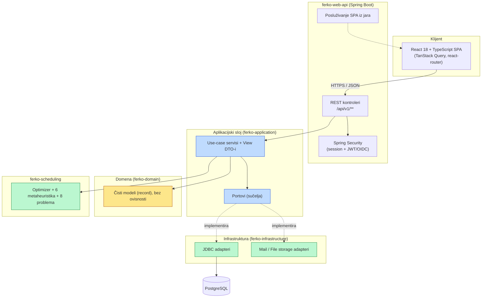
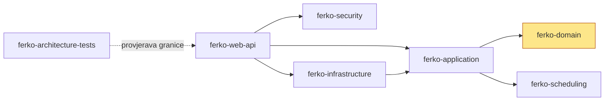
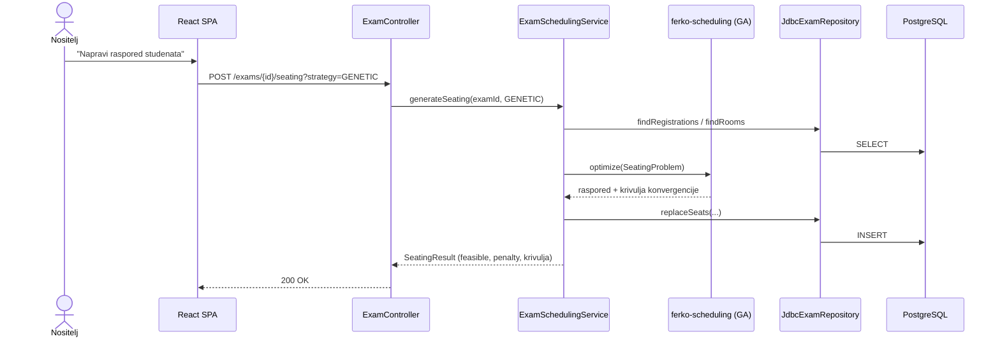
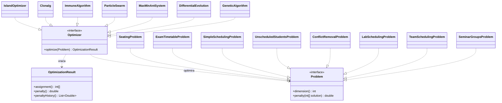
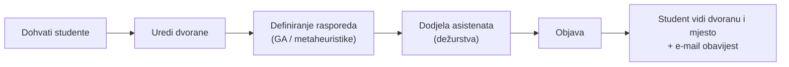
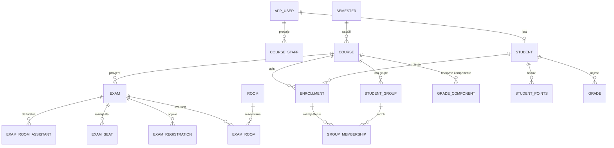

<div align="center">

# FERKO

### Akademski portal za organizaciju nastave — moderniziran, otvoren, spreman za produkciju

*A faithful, modern rewrite of FER's academic portal — with an evolutionary exam-scheduling engine at its core.*

[](#kvaliteta-i-testiranje)
[](#tehnologije)
[](#tehnologije)
[](#tehnologije)
[](#tehnologije)
[](#licenca)

**`docker compose up` → potpun, seedan akademski portal na [localhost:8080](http://localhost:8080)**

</div>

---

## Sadržaj

- [Što je FERKO](#što-je-ferko)
- [Naslijeđe — prof. dr. sc. Marko Čupić](#naslijeđe--prof-dr-sc-marko-čupić)
- [Ključne mogućnosti](#ključne-mogućnosti)
- [Brzi početak](#brzi-početak)
- [Demo korisnici](#demo-korisnici)
- [Arhitektura](#arhitektura)
- [Evolucijski mehanizam raspoređivanja](#evolucijski-mehanizam-raspoređivanja)
- [Model podataka](#model-podataka)
- [Tehnologije](#tehnologije)
- [Razvoj](#razvoj)
- [Kvaliteta i testiranje](#kvaliteta-i-testiranje)
- [Struktura projekta](#struktura-projekta)
- [Dokumentacija](#dokumentacija)
- [Autori i zahvale](#autori-i-zahvale)
- [Licenca](#licenca)

---

## Što je FERKO

**FERKO** je akademski portal za organizaciju nastave na velikom tehničkom fakultetu: kolegiji i
upisi, grupe i razmještaj studenata, provjere znanja i njihovo raspoređivanje po dvoranama,
bodovi i ocjene, obavijesti, ankete, repozitorij materijala, forum, konzultacije i e-portfolio —
sve kroz moderno, dvojezično (HR/EN) web-sučelje, s ulogama prilagođenim svakom sudioniku
nastavnog procesa.

Srce sustava je **evolucijski mehanizam raspoređivanja provjera znanja**: studenti se genetskim
algoritmom (i još pet obitelji metaheuristika) raspoređuju po dvoranama tako da nijedna nije
prekapacitirana, a raspored se objavljuje studentima zajedno s točnim mjestom sjedenja.

> Cijeli sustav podiže se **jednom Docker komandom** i dolazi unaprijed napunjen stvarnim
> FER-ovim podacima o kolegijima — spreman za isprobavanje u jednoj minuti.

---

## Naslijeđe — prof. dr. sc. Marko Čupić

FERKO nije nova ideja. Originalni **FERKO** osmislio je i razvio **prof. dr. sc. Marko Čupić**
s Fakulteta elektrotehnike i računarstva Sveučilišta u Zagrebu, i taj je sustav **i danas u
aktivnoj produkcijskoj uporabi** za tisuće studenata i nastavnika:

> ### 🔗 [https://ferko.fer.hr/ferko](https://ferko.fer.hr/ferko)

Ovaj projekt je **modernizirani prepis (re-implementacija)** koji s poštovanjem nastavlja taj rad:
zadržava vjernu informacijsku arhitekturu i radne tokove originala, a evolucijski mehanizam
raspoređivanja izravno se temelji na doktorskoj disertaciji prof. Čupića:

> **Marko Čupić (2011), _Raspoređivanje nastavnih aktivnosti evolucijskim računanjem_**, doktorski
> rad, Sveučilište u Zagrebu, Fakultet elektrotehnike i računarstva.

Formalni modeli problema raspoređivanja (pogl. 4), obitelji metaheuristika (pogl. 5),
paralelizacija (pogl. 6) i model objave rasporeda (pogl. 7) iz disertacije implementirani su u
modulu [`ferko-scheduling`](backend/ferko-scheduling). Sva zahvala za izvorni koncept, dizajn i
dugogodišnje održavanje produkcijskog FERKA pripada prof. Čupiću.

---

## Ključne mogućnosti

FERKO modelira **sedam uloga** (`STUDENT`, `NASTAVNIK`, `NOSITELJ`, `ASISTENT`,
`ASISTENT_ORGANIZATOR`, `STUSLU`, `ADMIN`) i sučelje se prilagođava svakoj.

| Područje | Mogućnosti |
|----------|-----------|
| 🎓 **Student** | Moje provjere (s dvoranom i mjestom nakon objave), samoprijava/odjava na provjeru, Moji bodovi po komponentama i ocjene, e-Portfolio, osobni profil, kalendar i obavijesti |
| 📚 **Stranica kolegija** | O kolegiju, Obavijesti, Raspored nastave, Literatura (obavezna/preporučena), Konzultacije, KOMPONENTE, popis nastavnog osoblja, grupe |
| 📝 **Provjere znanja** | Definiranje provjera, rezervacija dvorana, prijava studenata, **evolucijsko raspoređivanje po dvoranama**, usporedba 6 algoritama s krivuljama konvergencije, dodjela dežurnih asistenata, objava, dijagram toka |
| 💯 **Bodovi i ocjene** | Bodovne komponente, unos bodova, preglednik bodova, automatsko ocjenjivanje skeniranih obrazaca, zastavice/preduvjeti s vlastitim sigurnim interpreterom izraza |
| 🧑‍🏫 **Nastavno osoblje** | Dodjela uloga na kolegiju, dodjela dežurstava, Moja dežurstva, objava obavijesti i konzultacija |
| 🗂️ **STUSLU** | Upis studenata, razmještaj u grupe, pregled upisanih |
| 🛠️ **Administracija** | Kreiranje semestra, upravljanje korisnicima, status sinkronizacija, **zapis revizije (audit trail)** privilegiranih radnji |
| 🔁 **Suradnja** | Burza grupa (samoposluga zamjene), forum (Pitanja i problemi), ankete (evaluacija kolegija), repozitorij datoteka |
| 🌐 **Platforma** | Dvojezičnost HR/EN, kalendar svih aktivnosti, e-mail obavijesti, rate-limiting prijava, observability (`/actuator`) |

---

## Brzi početak

Potreban je samo **Docker** (Desktop ili Engine + Compose).

```bash
git clone <repo-url> ferko && cd ferko
./scripts/dev-up.sh          # gradi SPA + backend i pokreće aplikaciju + PostgreSQL
```

Skripta čeka da aplikacija postane zdrava, a zatim je dostupno:

| | |
|---|---|
| 🖥️ **Aplikacija (SPA)** | <http://localhost:8080> |
| ❤️ **Health** | <http://localhost:8080/actuator/health> |
| 📘 **OpenAPI (JSON)** | <http://localhost:8080/v3/api-docs> |
| ℹ️ **Verzija builda** | <http://localhost:8080/actuator/info> |

```bash
./scripts/dev-down.sh        # zaustavi
./scripts/dev-reset.sh       # zaustavi i obriši volumen baze (čisti reset)
```

Baza se pri prvom pokretanju automatski migrira (Flyway) i puni stvarnim FER-ovim podacima:
aktivni ljetni semestar 2026. s cijelim skupom kolegija i stvarnim upisima studenata, nositeljima
i izvođačima iz ISVU kataloga, dvoranama izvedenim iz rasporeda te prošlim zimskim semestrom
2025/2026. za povijest. Opseg punjenja podesiv je preko `FERKO_SEED_ACADEMIC_MAX_COURSES` i
`FERKO_SEED_ACADEMIC_MAX_STUDENTS` (0 = bez ograničenja).

---

## Demo korisnici

Svi korisnici imaju lozinku **`ferko123`**.

| Korisničko ime | Uloga | Za isprobati |
|----------------|-------|--------------|
| `student.ana` | STUDENT | Moje provjere, Moji bodovi, prijava na provjeru, e-Portfolio |
| `lecturer.marko` | NOSITELJ | Stranica kolegija, definiranje i raspoređivanje provjera, dežurstva |
| `assistant.iva` | ASISTENT | Moja dežurstva, konzultacije |
| `stuslu.sara` | STUSLU | Upis i razmještaj studenata u grupe |
| `admin.ferko` | ADMIN | Admin konzola, korisnici, semestri, zapis revizije |

---

## Arhitektura

FERKO je **Maven multimodulni** projekt građen po načelima **heksagonalne arhitekture (ports &
adapters)**. Domena ne ovisi ni o čemu; aplikacijski sloj definira portove (sučelja);
infrastruktura ih implementira; web sloj nikada izravno ne ovisi o domeni. Granice su strojno
provjerene **ArchUnit** testovima.



**Moduli i smjer ovisnosti** (strelica = „ovisi o”):



Pravilo koje ArchUnit čuva: **`..webapi..` nikada ne uvozi `..domain..`** — web sloj komunicira
isključivo preko aplikacijskih view/use-case tipova. Detaljnije:
[`docs/architecture/ARCHITECTURE.md`](docs/architecture/ARCHITECTURE.md).

### Tok zahtjeva (primjer: raspoređivanje provjere)



---

## Evolucijski mehanizam raspoređivanja

Modul [`ferko-scheduling`](backend/ferko-scheduling) je **čista Java** (bez Springa) i implementira
formalizam iz disertacije prof. Čupića. Apstrakcija je namjerno generička: bilo koji `Problem`
može optimirati bilo koji `Optimizer`.



**Šest obitelji metaheuristika:** genetski algoritam (GA), diferencijska evolucija (DE),
Max-Min mravlji sustav (MMAS), optimizacija rojem čestica (PSO), jednostavni imunološki algoritam
(SIA) i CLONALG; uz **paralelni otočni model** (`IslandOptimizer`).

**Osam formalnih problema** iz disertacije (pogl. 4): jednostavno raspoređivanje, neraspoređeni
studenti po predavanjima, uklanjanje konflikata u satnici, raspored laboratorijskih vježbi,
raspored provjera (seating), raspored prostorija (timetable), raspoređivanje timova i prezentacijske
grupe za seminare.

Sučelje aplikacije nudi **usporedni prikaz** svih šest algoritama nad istim problemom (jednak
budžet i sjeme) s krivuljama konvergencije, pa korisnik bira najbolji. Determinističko sjeme
osigurava ponovljivost. Više: [`docs/architecture/SCHEDULING_ENGINE.md`](docs/architecture/SCHEDULING_ENGINE.md).

### Radni tok provjere znanja



---

## Model podataka

Normalizirana shema (PostgreSQL u produkciji, H2 u PostgreSQL-modu za razvoj/testove), verzionirana
**Flyway** migracijama (`V1`–`V14`). Glavni agregati:



Uz akademsku jezgru: obavijesti, ankete, forum, komponente kolegija, literatura, konzultacije,
repozitorij datoteka, burza grupa, satnica, e-portfolio i zapis revizije. Cijela shema:
[`docs/architecture/DOMAIN_MODEL.md`](docs/architecture/DOMAIN_MODEL.md).

---

## Tehnologije

| Sloj | Tehnologija |
|------|-------------|
| Jezik / runtime | **Java 21**, Maven (multimodul) |
| Backend | **Spring Boot 3.5** (Web, Security, JDBC, Actuator, Flyway) |
| Baza | **PostgreSQL** (produkcija), **H2** u PostgreSQL-modu (razvoj/test) |
| Frontend | **React 18 + TypeScript**, Vite, TanStack Query, react-router |
| Raspoređivanje | Vlastiti modul čiste Jave (`ferko-scheduling`) |
| Sigurnost | Spring Security — session form-login + JWT/OIDC chain; rate-limiting |
| Kvaliteta | JUnit 5, ArchUnit, JaCoCo, Checkstyle, Spotless |
| Isporuka | Docker, Docker Compose, GitHub Actions (CI), Trivy (sigurnosno skeniranje) |

---

## Razvoj

Lokalni JDK može biti bilo koji; build i testovi izvode se **u kontejneru** (projekt cilja JDK 21).

```bash
# Brza provjera frontenda (TypeScript + Vite):
cd frontend && docker run --rm -v "$PWD":/app -w /app node:20.18.0 \
  bash -lc 'npm ci && npm run build'

# Puni quality gate (Temurin 21):
docker run --rm -v "$PWD":/workspace -v ferko-m2:/root/.m2 -w /workspace \
  maven:3.9.9-eclipse-temurin-21 bash -lc './mvnw -B -ntp spotless:apply && ./mvnw -B -ntp verify'
```

Nove se funkcionalnosti grade kao **vertikalni rezovi** kroz sve slojeve (domena → port → adapter →
servis → REST → migracija → testovi → frontend). Vodič:
[`docs/architecture/CONTRIBUTING.md`](docs/architecture/CONTRIBUTING.md).

---

## Kvaliteta i testiranje

Svaki `verify` mora biti zelen prije mergea. Quality gate obuhvaća:

- **Jedinične i integracijske testove** (JUnit 5; preko 100 testnih klasa) — aplikacijski sloj s
  in-memory fakeovima, infrastruktura s H2 adapter testovima, web sloj s `@SpringBootTest`/MockMvc.
- **ArchUnit** — granice modula i pravila ovisnosti.
- **JaCoCo** — prag pokrivenosti 70% linija po modulu.
- **Checkstyle + Spotless** — stil i formatiranje (Google Java Format).
- **CI (GitHub Actions)** — build, testovi, container-smoke (provjera da jar poslužuje SPA),
  multiarch build, Trivy sigurnosno skeniranje, dependency review.

---

## Struktura projekta

```text
ferko/
├── backend/
│   ├── ferko-domain/            # čisti domenski modeli (record), bez ovisnosti
│   ├── ferko-application/       # use-caseovi, portovi, view DTO-i
│   ├── ferko-infrastructure/    # JDBC / mail / file-storage adapteri
│   ├── ferko-security/          # sigurnosna granica
│   ├── ferko-scheduling/        # evolucijski optimizatori + problemi (čista Java)
│   ├── ferko-web-api/           # Spring Boot app, REST, Flyway, posluživanje SPA
│   └── ferko-architecture-tests/# ArchUnit pravila granica
├── frontend/                    # React + TypeScript + Vite SPA
├── docs/                        # arhitektura, ADR-ovi, API, vodiči
├── scripts/                     # dev-up / dev-down / dev-reset
├── docker-compose.yml
└── README.md
```

---

## Dokumentacija

| Dokument | Sadržaj |
|----------|---------|
| [docs/architecture/ARCHITECTURE.md](docs/architecture/ARCHITECTURE.md) | Heksagonalna arhitektura, moduli, granice, tokovi |
| [docs/architecture/DOMAIN_MODEL.md](docs/architecture/DOMAIN_MODEL.md) | Model podataka, agregati, uloge, ER dijagram |
| [docs/architecture/SCHEDULING_ENGINE.md](docs/architecture/SCHEDULING_ENGINE.md) | Disertacija prof. Čupića → kod: problemi i algoritmi |
| [docs/architecture/CONTRIBUTING.md](docs/architecture/CONTRIBUTING.md) | Razvojni ritam, vertikalni rez, konvencije |
| [docs/operations/PRODUCTION_DEPLOYMENT.md](docs/operations/PRODUCTION_DEPLOYMENT.md) | Produkcijski compose, prod profil, env, topologija |
| [docs/adr/](docs/adr) | Architecture Decision Records |
| [docs/api/openapi.yaml](docs/api/openapi.yaml) | OpenAPI specifikacija |

---

## Autori i zahvale

- **Karlo Knežević** — modernizirani prepis (ovaj repozitorij).
- **prof. dr. sc. Marko Čupić** — autor originalnog FERKA ([ferko.fer.hr/ferko](https://ferko.fer.hr/ferko))
  i doktorske disertacije na kojoj se temelji mehanizam raspoređivanja. Iskrene zahvale na izvornom
  radu, dizajnu i dugogodišnjem održavanju produkcijskog sustava.
- **Fakultet elektrotehnike i računarstva, Sveučilište u Zagrebu** — domena i nastavni kontekst.

---

## Licenca

Izdano pod **Apache License 2.0** — vidi [`LICENSE`](LICENSE). Naziv „FERKO” i pripadnost FER-u
koriste se uz poštovanje izvornog autora; ovaj je projekt nezavisna, edukativna re-implementacija.
