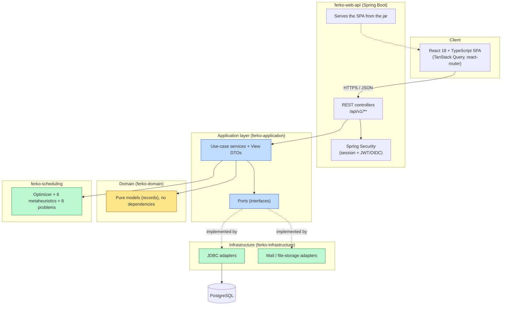
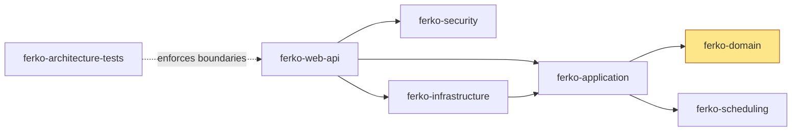
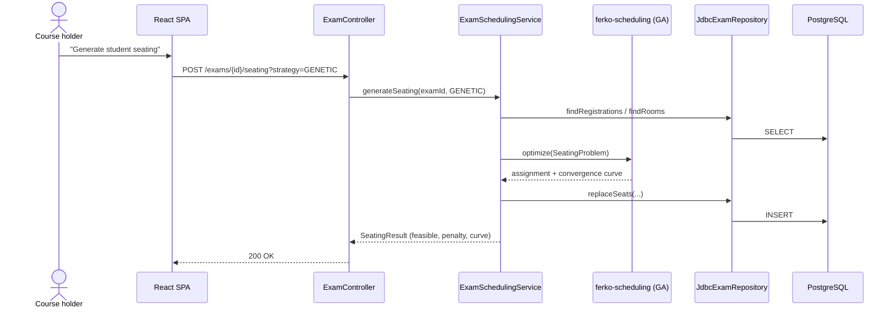
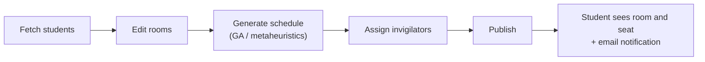
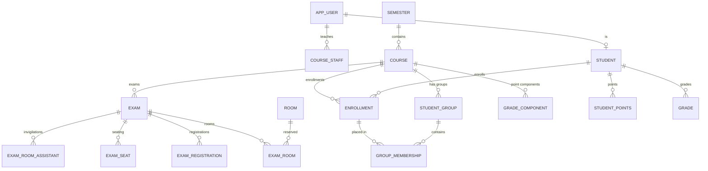

<div align="center">

# FERKO

### A modern, open, production-ready academic portal for FER

*A faithful, modern reimplementation of FER's FERKO portal — with an evolutionary exam- and lecture-scheduling engine at its core.*

[](#quality--testing)
[](#technology)
[](#technology)
[](#technology)
[](#technology)
[](#license)

**`docker compose up` → a fully seeded academic portal at [localhost:8080](http://localhost:8080)**

</div>

---

## Contents

- [What is FERKO](#what-is-ferko)
- [Heritage — prof. dr. sc. Marko Čupić](#heritage--prof-dr-sc-marko-čupić)
- [Feature overview](#feature-overview)
- [Quick start](#quick-start)
- [Demo accounts](#demo-accounts)
- [Pre-seeded demo data](#pre-seeded-demo-data)
- [Architecture](#architecture)
- [The scheduling engine](#the-scheduling-engine)
- [Roles and authorization](#roles-and-authorization)
- [Data model](#data-model)
- [Technology](#technology)
- [Development](#development)
- [Quality and testing](#quality-and-testing)
- [Project structure](#project-structure)
- [Documentation](#documentation)
- [Credits](#credits)
- [License](#license)

---

## What is FERKO

**FERKO** is an academic portal for organizing teaching at a large technical faculty: courses and
enrollments, student groups and placement, assessments and their allocation to exam rooms, points
and grades, notices, surveys, a materials repository, a forum, consultations and an e-portfolio —
all delivered through a modern, bilingual (HR/EN) web interface, with roles tailored to every
participant in the teaching process.

At the heart of the system is an **evolutionary scheduling engine**: a genetic algorithm (and five
further families of metaheuristics) assigns students to exam rooms so that no room is over capacity,
generates collision-free lecture and exam timetables, and publishes the result to students together
with their exact seat.

> The entire system comes up with **a single Docker command** and arrives pre-loaded with the real
> FER course catalogue — ready to explore in under a minute.

---

## Heritage — prof. dr. sc. Marko Čupić

FERKO is not a new idea. The original **FERKO** was conceived and built by **prof. dr. sc. Marko
Čupić** of the Faculty of Electrical Engineering and Computing (FER), University of Zagreb, and that
system is **still in active production use today** by thousands of students and teachers:

> ### [https://ferko.fer.hr/ferko](https://ferko.fer.hr/ferko)

This project is a **modern reimplementation** that respectfully continues that work: it preserves
the faithful information architecture and workflows of the original, while the evolutionary
scheduling engine is taken directly from prof. Čupić's doctoral thesis:

> **Marko Čupić (2011), _Scheduling of Teaching Activities Using Evolutionary Computation_**,
> doctoral thesis, University of Zagreb, Faculty of Electrical Engineering and Computing.

The formal scheduling problem models (ch. 4), the families of metaheuristics (ch. 5), the
parallelization (ch. 6) and the timetable-publication model (ch. 7) from the thesis are implemented
in the [`ferko-scheduling`](backend/ferko-scheduling) module. All credit for the original concept,
design and long-running maintenance of the production FERKO belongs to prof. Čupić.

---

## Feature overview

FERKO models **seven roles** (`STUDENT`, `NASTAVNIK`, `NOSITELJ`, `ASISTENT`,
`ASISTENT_ORGANIZATOR`, `STUSLU`, `ADMIN`) and the interface adapts to each one.

| Area | Capabilities |
|------|--------------|
| **Student** | My exams (with room and seat once published), self-registration / withdrawal from an exam, my points by component and my grades, my demonstratures and my invigilations, e-portfolio, personal profile, calendar and notices |
| **Course page** | Course overview, notices, lecture schedule, literature (mandatory / recommended), consultations, content components, teaching-staff listing, groups, surveys, forum, file repository, group exchange |
| **Lecture timetable** | Faculty-wide weekly timetable of lectures and labs (by day, room and instructor), filtering, an administrative report on room/instructor collisions and room utilisation, **evolutionary timetable generation** that places the courses of a chosen study year into time slots while minimising student collisions (with a convergence curve), and an **algorithm-comparison dashboard** running all six metaheuristics on the same problem |
| **Exams** | Define exams, reserve rooms, register students, **evolutionary seating into rooms**, **evolutionary exam-timetable generation** (collision-free, compared against the historical schedule), comparison of all six algorithms with convergence curves, invigilator assignment, publication, workflow diagram |
| **Points and grades** | Point components, point entry, gradebook viewer, automatic grading of scanned exam forms, holder-editable per-course grade thresholds with one-click final-grade recomputation, and prerequisite flags |
| **Teaching staff** | Course-role assignment, invigilation duty assignment, my invigilations, demonstrator (demonstrature) management, publishing notices and consultations |
| **STUSLU** | Student enrollment, placement into groups, viewing the enrolled |
| **Administration** | Semester creation, user management, synchronisation status, read-only settings, **audit trail** of privileged actions |
| **Platform** | Bilingual HR/EN UI, calendar of all activities, email pipeline, login rate limiting, observability (`/actuator`), production Compose profile |

---

## Quick start

All you need is **Docker** (Desktop, or Engine + Compose).

```bash
git clone <repo-url> ferko && cd ferko
docker compose up                # or: ./scripts/dev-up.sh
```

`./scripts/dev-up.sh` builds the SPA and backend, starts the application and PostgreSQL, and waits
until the application reports healthy. Once up:

| | |
|---|---|
| **Application (SPA)** | <http://localhost:8080> |
| **Health** | <http://localhost:8080/actuator/health> |
| **OpenAPI (JSON)** | <http://localhost:8080/v3/api-docs> |
| **Build info / version** | <http://localhost:8080/actuator/info> |

```bash
./scripts/dev-down.sh        # stop
./scripts/dev-reset.sh       # stop and drop the database volume (clean reset)
```

On first start the database is migrated automatically (Flyway) and seeded with real FER data — see
[Pre-seeded demo data](#pre-seeded-demo-data) below.

---

## Demo accounts

All accounts share the password **`ferko123`**.

| Username | Role | What to try |
|----------|------|-------------|
| `student.ana` | STUDENT | My exams, my points, exam registration, e-portfolio |
| `lecturer.marko` | NOSITELJ | Course page, defining and scheduling exams, invigilation duties |
| `assistant.iva` | ASISTENT | My invigilations, consultations |
| `stuslu.sara` | STUSLU | Enrolling and placing students into groups |
| `admin.ferko` | ADMIN | Admin console, users, semesters, audit trail |

---

## Pre-seeded demo data

FERKO ships ready to demonstrate at scale. On first boot it loads:

- An **active Summer 2026 semester** carrying the **full real FER dataset**: roughly **170 courses**
  with enrollments, around **3,500 students**, course holders and lecturers drawn from the **ISVU**
  catalogue, rooms derived from the timetable, and demonstrators.
- A **past Winter 2025/2026 semester** for history and comparisons.
- The **real weekly lecture timetable**, used both for the faculty timetable views and as the
  historical baseline against which the evolutionary exam-timetable generator is compared.
- **Simulated points by component and a computed final grade for every enrolled student**, so
  gradebooks, viewers and grade-threshold logic are populated out of the box.

The seeding scale is configurable. Set `FERKO_SEED_ACADEMIC_MAX_COURSES` and
`FERKO_SEED_ACADEMIC_MAX_STUDENTS` to cap the import for a lighter footprint, or use `0` (the
default for the full set) for **no limit**.

---

## Architecture

FERKO is a **Maven multi-module** project built on the principles of **hexagonal architecture
(ports & adapters)**. The domain depends on nothing; the application layer defines ports
(interfaces); the infrastructure implements them; the web layer never depends on the domain
directly. These boundaries are enforced mechanically by **ArchUnit** tests.



The React SPA is built by Vite and **packaged into the Spring Boot jar**, so a single artifact serves
both the API and the UI. **PostgreSQL** is the production datastore; **H2** in PostgreSQL mode backs
development and tests.

**Modules and dependency direction** (arrow = "depends on"):



The rule ArchUnit guards: **`..webapi..` never imports `..domain..`** — the web layer communicates
exclusively through application view / use-case types. More:
[`docs/architecture/architecture.md`](docs/architecture/architecture.md).

### Request flow (example: seating an exam)



---

## The scheduling engine

The [`ferko-scheduling`](backend/ferko-scheduling) module is **pure Java** (no Spring) and implements
the formalism from prof. Čupić's thesis. The abstraction is deliberately generic: any `Problem` can
be optimized by any `Optimizer`.


**Six families of metaheuristics:** genetic algorithm (GA), differential evolution (DE), Max-Min Ant
System (MMAS), particle swarm optimization (PSO), a simple immune algorithm (SIA) and CLONALG; plus a
parallel **island hybrid** (`IslandOptimizer`).

**Eight formal problems** from the thesis (ch. 4): simple scheduling, unscheduled students across
lectures, conflict removal in a timetable, lab-session scheduling, exam seating, exam/room timetable,
team scheduling and seminar presentation groups.

The application puts the engine to three end-user uses:

1. **Exam seating into rooms** — assign registered students to seats across reserved rooms, with an
   all-six-algorithm comparison and convergence curves.
2. **Evolutionary lecture-timetable generation** — place the courses of a study year into time slots
   so that student collisions are minimised, with the convergence curve shown.
3. **Exam-timetable generation** — produce a collision-free exam schedule and compare it against the
   historical schedule.

A faculty timetable view adds room/instructor collision detection and room utilisation, and an
algorithm-comparison dashboard runs every metaheuristic on the same problem under an equal budget and
seed. The deterministic seed guarantees reproducibility. More:
[`docs/architecture/scheduling-engine.md`](docs/architecture/scheduling-engine.md).

### Exam workflow



---

## Roles and authorization

FERKO uses **two layers of authorization**:

- **Role-based access** — declarative `@PreAuthorize` checks gate endpoints by role (`STUDENT`,
  `NASTAVNIK`, `NOSITELJ`, `ASISTENT`, `ASISTENT_ORGANIZATOR`, `STUSLU`, `ADMIN`).
- **Row-level course access** — beyond the role, what each user can see is scoped to the courses
  they are attached to. An `ADMIN` sees everything; a `STUDENT` is the most restricted, seeing only
  their own enrollments, points, exams and grades.

Authentication runs through Spring Security with a session form-login and an optional JWT/OIDC chain.
Login attempts are rate-limited in the production profile. Full details:
[`docs/architecture/security-model.md`](docs/architecture/security-model.md).

---

## Data model

A normalized schema (PostgreSQL in production, H2 in PostgreSQL mode for development and tests),
versioned with **Flyway** migrations (currently up to `V15`). Core aggregates:



Around this academic core sit notices, surveys, the forum, course content components, literature,
consultations, the file repository, group exchange, the lecture timetable, demonstrators, the
e-portfolio and the audit trail. The full schema:
[`docs/architecture/domain-model.md`](docs/architecture/domain-model.md).

---

## Technology

| Layer | Technology |
|-------|------------|
| Language / runtime | **Java 21**, Maven (multi-module) |
| Backend | **Spring Boot 3.5** (Web, Security, JDBC, Actuator, Flyway) |
| Database | **PostgreSQL** (production), **H2** in PostgreSQL mode (development / test) |
| Frontend | **React 18 + TypeScript**, Vite, TanStack Query, react-router — built into the jar |
| Scheduling | A dedicated pure-Java module (`ferko-scheduling`) |
| Security | Spring Security — session form-login + JWT/OIDC chain; login rate limiting |
| Quality | JUnit 5, ArchUnit, JaCoCo, Checkstyle, Spotless |
| Delivery | Docker, Docker Compose, GitHub Actions (CI), Trivy (security scanning) |

---

## Development

The local JDK can be anything; builds and tests run **inside a container** (the project targets
JDK 21).

```bash
# Quick frontend check (TypeScript + Vite):
cd frontend && docker run --rm -v "$PWD":/app -w /app node:20.18.0 \
  bash -lc 'npm ci && npm run build'

# Full quality gate (Temurin 21):
docker run --rm -v "$PWD":/workspace -v ferko-m2:/root/.m2 -w /workspace \
  maven:3.9.9-eclipse-temurin-21 bash -lc './mvnw -B -ntp spotless:apply && ./mvnw -B -ntp verify'
```

New functionality is built as **vertical slices** through every layer (domain → port → adapter →
service → REST → migration → tests → frontend). Guide:
[`docs/architecture/contributing.md`](docs/architecture/contributing.md).

---

## Quality and testing

Every `verify` must be green before a merge. The quality gate covers:

- **Unit and integration tests** (JUnit 5) — the application layer with in-memory fakes, the
  infrastructure with H2 adapter tests, and the web layer with `@SpringBootTest` / MockMvc.
- **ArchUnit** — module boundaries and dependency rules.
- **JaCoCo** — a 70% line-coverage threshold per module.
- **Checkstyle + Spotless** — style and formatting (Google Java Format).
- **CI (GitHub Actions)** — build, tests, a container smoke test (verifying the jar serves the SPA),
  a multi-arch image build, Trivy security scanning, and dependency review.

---

## Project structure

```text
ferko/
├── backend/
│   ├── ferko-domain/             # pure domain models (records), no dependencies
│   ├── ferko-application/        # use cases, ports, view DTOs
│   ├── ferko-infrastructure/     # JDBC / mail / file-storage adapters
│   ├── ferko-security/           # security boundary
│   ├── ferko-scheduling/         # evolutionary optimizers + problems (pure Java)
│   ├── ferko-web-api/            # Spring Boot app, REST, Flyway, serves the SPA
│   └── ferko-architecture-tests/ # ArchUnit boundary rules
├── frontend/                     # React + TypeScript + Vite SPA
├── docs/                         # architecture, ADRs, API, guides
├── scripts/                      # dev-up / dev-down / dev-reset
├── docker-compose.yml            # development stack (app + PostgreSQL)
├── docker-compose.prod.yml       # production profile
└── README.md
```

---

## Documentation

| Document | Contents |
|----------|----------|
| [docs/architecture/architecture.md](docs/architecture/architecture.md) | Hexagonal architecture, modules, boundaries, flows |
| [docs/architecture/domain-model.md](docs/architecture/domain-model.md) | Data model, aggregates, roles, ER diagram |
| [docs/architecture/scheduling-engine.md](docs/architecture/scheduling-engine.md) | From prof. Čupić's thesis to code: problems and algorithms |
| [docs/architecture/security-model.md](docs/architecture/security-model.md) | Authentication, role-based and row-level authorization |
| [docs/user-guide.md](docs/user-guide.md) | End-user guide per role and workflow |
| [docs/architecture/contributing.md](docs/architecture/contributing.md) | Development rhythm, the vertical slice, conventions |
| [docs/operations/production-deployment.md](docs/operations/production-deployment.md) | Production Compose, prod profile, env, topology |

---

## Credits

- **Karlo Knežević** — the modern reimplementation (this repository).
- **prof. dr. sc. Marko Čupić** — author of the original FERKO
  ([ferko.fer.hr/ferko](https://ferko.fer.hr/ferko)) and of the doctoral thesis on which the
  scheduling engine is based. Sincere thanks for the original work, design and long-running
  maintenance of the production system.
- **Faculty of Electrical Engineering and Computing, University of Zagreb** — the domain and
  teaching context.

---

## License

Released under the **Apache License 2.0** — see [`LICENSE`](LICENSE). The name "FERKO" and the
association with FER are used with respect for the original author; this is an independent,
educational reimplementation.
</content>
</invoke>
