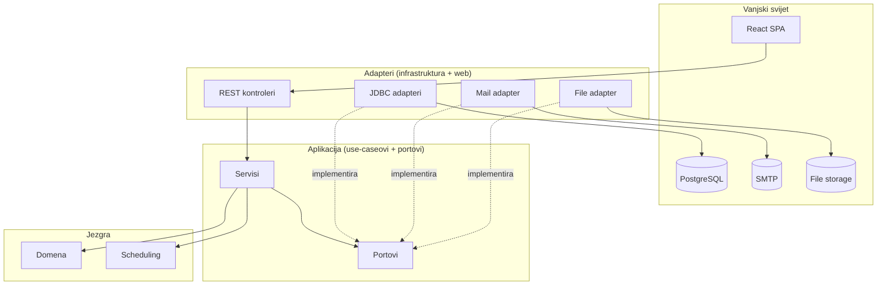
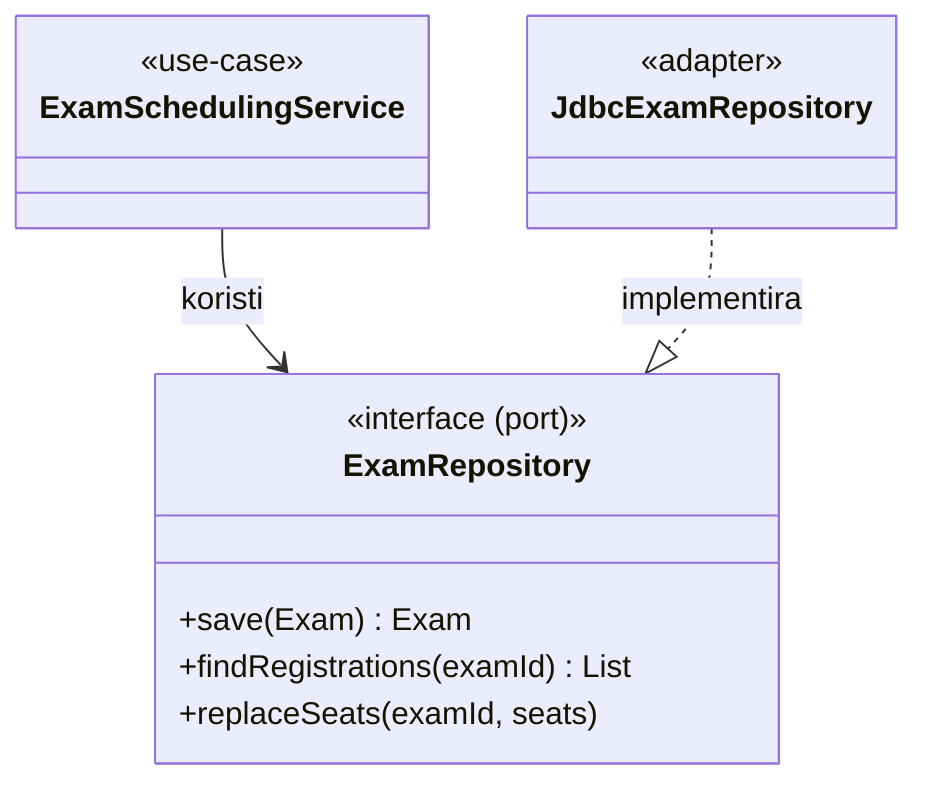

# Arhitektura

FERKO je građen po načelima **heksagonalne arhitekture** (ports & adapters) i **čiste
arhitekture**: poslovna logika ne ovisi o okviru, bazi ni transportu. Ovisnosti pokazuju prema
unutra — prema domeni.

## Slojevi i moduli

| Modul | Uloga | Smije ovisiti o |
|-------|-------|-----------------|
| `ferko-domain` | Čisti domenski modeli (Java `record`), bez ikakvih ovisnosti | — |
| `ferko-scheduling` | Evolucijski optimizatori i problemi (čista Java) | — |
| `ferko-application` | Use-caseovi, **portovi** (sučelja), view DTO-i | domain, scheduling |
| `ferko-infrastructure` | JDBC / mail / file-storage **adapteri** (implementacije portova) | application, domain |
| `ferko-security` | Sigurnosna granica | application |
| `ferko-web-api` | Spring Boot aplikacija: REST, Flyway, wiring, posluživanje SPA | application, infrastructure, security |
| `ferko-architecture-tests` | ArchUnit pravila koja čuvaju granice | — |

## Pravilo zlatne niti: web ne ovisi o domeni

`..webapi..` **nikada** ne uvozi `..domain..`. Kontroleri rade isključivo s aplikacijskim
view/use-case tipovima; konstrukcija domenskih objekata događa se u aplikacijskom sloju (npr.
`AcademicProvisioningService.provisionClassSchedule(primitivi…)`). Ovo strojno provjerava
`ferko-architecture-tests` (ArchUnit). Time se:

- web sloj može mijenjati bez utjecaja na domenu,
- domena testira bez ikakvog okvira,
- spriječi „curenje” perzistencijskih detalja u API.

> Zamka: ArchUnit obrazac `..security..` hvata i `webapi.security` — zato sigurnosne klase u web
> sloju žive u paketu `webapi.auth`.

## Portovi i adapteri (primjer)

Spring povezuje beanove u jednom mjestu — `ApplicationBeans` (`webapi.config`) — tako da
aplikacijski servisi ostaju POJO-i bez Spring anotacija.

## Sigurnost

Dva Spring Security lanca:

1. **Session form-login** (`@Order 1`) za `/api/v1/auth/**` i `/api/v1/academic/**` — kolačić sesije,
   BCrypt, role `ROLE_*`. Anonimni pristup zaštićenim rutama → `401`.
2. **JWT/OIDC resource-server** (`@Order 2`) — konfigurabilan preko env varijabli za produkciju
   (AAI@EduHr / OIDC).

Metodne dozvole (`@PreAuthorize`) štite privilegirane radnje. Endpointi koji izlažu osobne podatke
(npr. popis upisanih s JMBAG-om) eksplicitno zahtijevaju nastavničke uloge. Prijava je zaštićena
rate-limitingom (produkcijski profil).

### Model ovlasti (uloge + razina retka)

Autorizacija ima dvije razine:

1. **Grube provjere po ulozi** (`@PreAuthorize` na metodama). Pregledne, javno-osjetljive matrice:
   - **Roster studenata** (`/students`, `/students/{jmbag}`) → sve nastavničke uloge + `STUSLU` +
     `ADMIN`. Student ne smije pretraživati roster.
   - **Preglednik bodova / ocjene** (`/points-overview`, `/grades`) → uloge koje ocjenjuju
     (`ADMIN, NOSITELJ, NASTAVNIK, ASISTENT_ORGANIZATOR, ASISTENT`).
   - **Organizacija ispita** (kreiranje, rezervacija dvorana, raspored sjedenja, dežurstva te
     read-only prikaz sjedenja/dežurnih) → organizatorska razina (`ADMIN, NOSITELJ,
     ASISTENT_ORGANIZATOR`) — uža od ocjenjivanja jer otkriva raspored studenata.
   - `ADMIN` vidi i mijenja sve; student ima najužu vidljivost (vlastiti podaci preko `/my/*`).
2. **Provjera na razini retka** (`AccessControlService` u aplikacijskom sloju, pozvana iz
   `CourseAccessGuard` u web sloju). Za sadržaj vezan uz kolegij (npr. repozitorij datoteka) pristup
   imaju samo `ADMIN`/`STUSLU`, nastavnici tog kolegija i upisani studenti. Tako student vidi samo
   materijale kolegija koje pohađa, a nastavnik samo onih koje predaje.

## Posluživanje SPA

`frontend-maven-plugin` gradi React SPA i `maven-resources-plugin` je kopira u jar
(`static/`, uz `overwrite=true`). `SpaForwardingController` prosljeđuje klijentske rute na
`index.html`. CI `container-smoke` provjerava da posluženi `index.html` zaista učitava `/assets/`
bundle (regresijska zaštita).

## Konvencije

- Bazni paket: `hr.fer.zemris.ferko`.
- DTO ↔ domena mapiranje u web sloju; web koristi samo aplikacijske view tipove.
- Flyway migracije su immutabilne nakon mergea; svaka promjena sheme je nova `V{n}`.
- Migracije moraju biti portabilne (H2 PostgreSQL-mode **i** PostgreSQL).
- UI tekst je hrvatski; i18n ključevi HR+EN.
