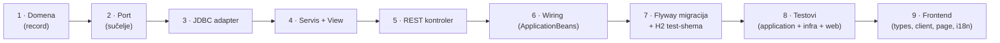

# Razvojni vodič

FERKO se gradi u malim, potpunim **vertikalnim rezovima**: svaka funkcionalnost prolazi kroz sve
slojeve i dolazi s testovima, tako da `master` ostaje uvijek zelen i deployabilan.

## Vertikalni rez



Koraci redom:

1. **Domena** — `record` u `ferko-domain`, bez ovisnosti.
2. **Port** — sučelje u `ferko-application/port`.
3. **Adapter** — `Jdbc*Repository` u `ferko-infrastructure/adapter` (RowMapper + `JdbcIds.insert`).
4. **Servis + View** — use-case u `ferko-application/usecase/<modul>`; validacija baca
   `IllegalArgumentException`.
5. **REST** — kontroler u `ferko-web-api/controller` s `@PreAuthorize` i `Authentication` za autora.
6. **Wiring** — dva `@Bean`-a u `ApplicationBeans`.
7. **Migracija** — `V{n}__*.sql` (portabilno) **i** ista tablica u
   `backend/ferko-infrastructure/src/test/resources/academic-schema-h2.sql`.
8. **Testovi** — application (in-memory fake, za pokrivenost), infrastructure (H2 adapter), web
   (`@SpringBootTest`/MockMvc za RBAC i tok).
9. **Frontend** — `api/types.ts`, `api/client.ts`, stranica u `pages/`, ruta u `App.tsx`, i18n
   ključevi HR+EN, navigacija/CSS.

## Verifikacija

Lokalni JDK može biti bilo koji; build se izvodi u kontejneru (cilj je JDK 21).

```bash
# brza provjera frontenda
cd frontend && docker run --rm -v "$PWD":/app -w /app node:20.18.0 \
  bash -lc 'npm ci && npm run build'

# puni quality gate
docker run --rm -v "$PWD":/workspace -v ferko-m2:/root/.m2 -w /workspace \
  maven:3.9.9-eclipse-temurin-21 bash -lc './mvnw -B -ntp spotless:apply && ./mvnw -B -ntp verify'
```

## Pravila i zamke

- **ArchUnit:** `..webapi..` ne smije uvoziti `..domain..`. Domenske objekte gradi aplikacijski
  sloj. Obrazac `..security..` hvata i `webapi.security` → koristi `webapi.auth`.
- **Portabilni SQL:** `bigint generated by default as identity` (ne `bigserial`),
  `current_timestamp` (ne `now()`), bez `DESC` indeksa. Zrcali tablicu u H2 test-shemu.
- **Posluživanje SPA:** `maven-resources-plugin` mora imati `overwrite=true` da jar ne posluži
  placeholder `index.html`.
- **Mapping kolizije:** prije novog `@GetMapping` provjeri da ista ruta već ne postoji.
- **JaCoCo 70% linija po modulu:** svaki modul s novim kodom treba vlastite testove.
- **Actuator/embedded testovi:** koristi `RANDOM_PORT` + `TestRestTemplate`, ne MockMvc.

## Tijek grananja

Feature grana → PR na `master` → CI (quality gate) zelen → squash-merge → sync. `master` je uvijek
deployabilan.
