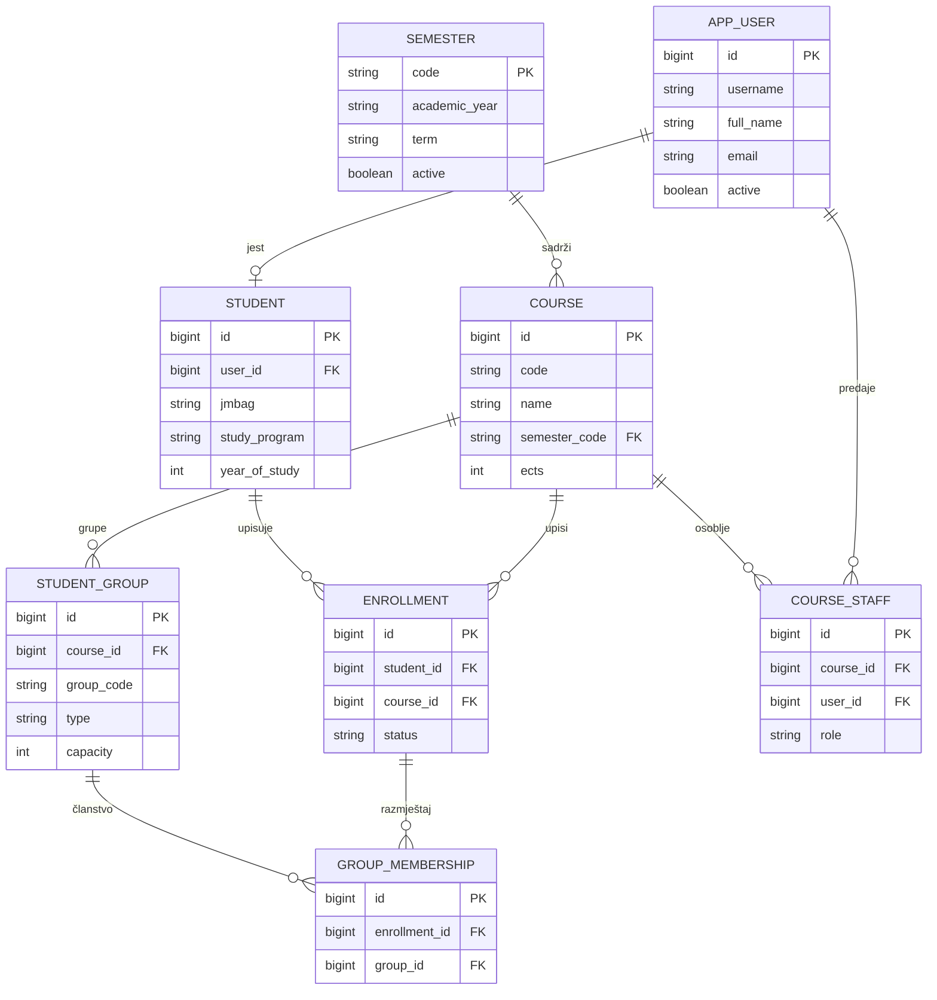
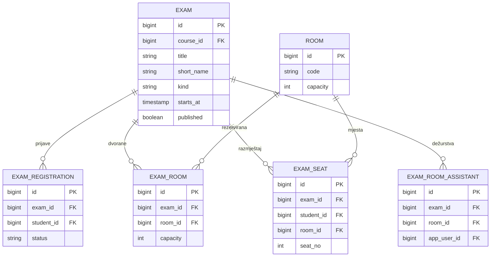

# Model podataka

Normalizirana relacijska shema, verzionirana Flyway migracijama (`V1`–`V14`). U produkciji radi na
**PostgreSQL**, a u razvoju i testovima na **H2 u PostgreSQL-modu** — zato su sve migracije pisane u
portabilnom podskupu SQL-a (`bigint generated by default as identity`, `current_timestamp`, bez
`DESC` u indeksima).

## Uloge

| Uloga | Oznaka | Opis |
|-------|--------|------|
| `STUDENT` | — | Upisani student |
| `NASTAVNIK` | P | Nastavnik na kolegiju |
| `NOSITELJ` | N | Nositelj kolegija |
| `ASISTENT` | A | Asistent |
| `ASISTENT_ORGANIZATOR` | S | Asistent organizator |
| `STUSLU` | — | Studentska služba |
| `ADMIN` | — | Administrator sustava |

## Akademska jezgra

## Provjere znanja i raspoređivanje

## Bodovi i ocjene

`GRADE_COMPONENT` (bodovne komponente kolegija) → `STUDENT_POINTS` (bodovi po komponenti, s
zastavicom `published`) → `GRADE` (konačna ocjena). Automatsko ocjenjivanje skeniranih obrazaca
provodi `AutoGrader` (točni odgovori + bodovna politika), a zastavice/preduvjeti evaluiraju se
vlastitim sigurnim interpreterom izraza (`present("MI1")`, `points(...)`, logički izrazi) — bez
izvršavanja proizvoljnog koda.

## Portalske usluge

Uz jezgru, shema pokriva: `OBAVIJEST`, `ANKETA` (+ pitanja/odgovori), `FORUM_POST`,
`KOMPONENTA_KOLEGIJA`, `LITERATURA_KOLEGIJA`, `KONZULTACIJE`, `REPOZITORIJ_DATOTEKA`,
`GROUP_EXCHANGE_REQUEST` (burza grupa), `CLASS_SCHEDULE` (satnica), `EPORTFOLIO_UNOS` i
`ACADEMIC_AUDIT_EVENT` (zapis revizije).

## Migracije

| Verzija | Sadržaj |
|---------|---------|
| V1–V3 | ToDo referentni rez, legacy bootstrap |
| V4 | Akademska jezgra (korisnici, semestri, kolegiji, grupe, upisi, dvorane) |
| V5 | Provjere, prijave, dvorane, razmještaj, bodovi, ocjene, satnica, burza, audit |
| V6–V9 | Obavijesti, ankete, forum, komponente kolegija |
| V10–V14 | Repozitorij, dežurstva, literatura, konzultacije, e-portfolio |

> Migracije su immutabilne nakon mergea; svaka nova promjena sheme dolazi kao nova `V{n}` i mora se
> zrcaliti u `backend/ferko-infrastructure/src/test/resources/academic-schema-h2.sql`.
