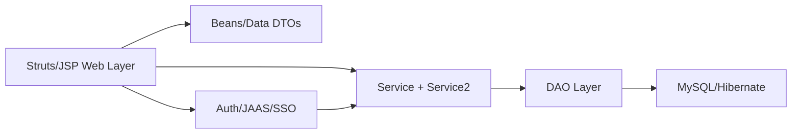

# Legacy Architecture Map (Phase 1)

Snapshot date: 2026-02-19

This map captures the current legacy monolith structure and identifies migration entry slices for strangler extraction.

## 1. Source Root Topology

| Source root | Java files | Notes |
|---|---:|---|
| `src/java` | 1169 | Core monolith (domain, DAO, services, web actions) |
| `src/desktop` | 31 | Desktop/support tooling |
| `src/tests` | 16 | Legacy tests |
| `src/auth` | 6 | Legacy auth providers (POP3/LDAP/FERWeb) |
| `src/planning` | 2 | Planning side module |
| `src/sscoretree` | 2 | Score-tree side module |
| `src/occvisualizer` | 1 | Visualizer side module |

## 2. Core Package Concentration (`src/java/hr/fer/zemris/jcms`)

| Package | Java files | Interpretation |
|---|---:|---|
| `web` | 437 | HTTP/controller layer dominates codebase |
| `beans` | 158 | Heavy DTO/form mapping footprint |
| `model` | 125 | Domain entities and core objects |
| `service` | 97 | Business/service orchestration |
| `dao` | 66 | Persistence contracts and implementation entry points |
| `service2` | 54 | Parallel service layer variant (technical debt indicator) |
| `parsers` | 52 | Parsing/transformation logic mixed into monolith |

## 3. Web Layer Breakdown

### Java web packages (`src/java/hr/fer/zemris/jcms/web`)

| Package | Java files |
|---|---:|
| `actions` | 273 |
| `actions2` | 91 |
| `navig` | 54 |
| `data` | 9 |
| `interceptors` | 8 |

### JSP view groups (`web/WEB-INF/pages`)

| Area | JSP files |
|---|---:|
| `main` | 147 |
| `v2` | 88 |
| `help` | 37 |
| `poll` | 16 |
| `global` | 16 |
| `forum` | 12 |
| `todo` | 5 |

## 4. Security/Auth Surface

| Area | Java files | Notes |
|---|---:|---|
| `src/auth` providers | 6 | POP3/LDAP/FERWeb provider stack |
| `src/java/.../jaas` | 3 | JAAS login module integration |
| `src/java/.../security` | 8 | Legacy security support classes |
| `src/java/.../service/sso` | 4 | Custom SSO integration logic |

## 5. Legacy Runtime Shape

Interpretation:
- UI/controller code dominates.
- Business logic is spread across web actions, services, and parsers.
- Security and identity concerns are coupled directly into runtime service paths.

## 6. Extraction Candidate Ranking (for Phase 1 -> Phase 2 handoff)

| Candidate | Estimated size | Rationale | Risk |
|---|---|---|---|
| `ToDo` vertical slice | 16 Java + 5 JSP | Small bounded feature set across model/dao/service/web, suitable as first end-to-end migration reference | Low |
| `Forum` vertical slice | 20 Java + 12 JSP | Medium complexity with user interactions and content flows | Medium |
| `Poll` vertical slice | 44 Java + 16 JSP | Broader flow and data coverage, better after first migration reference | Medium-high |

## 7. Recommended Immediate Extraction Target

Use `ToDo` as the first domain extraction reference slice:
1. Define modern domain model and use cases in `ferko-domain` and `ferko-application`.
2. Rebuild persistence adapter in `ferko-infrastructure`.
3. Expose REST endpoints in `ferko-web-api`.
4. Keep legacy endpoints running until parity and migration tests pass.

Status:
- Implemented on 2026-02-19 (see `docs/architecture/TODO_REFERENCE_SLICE.md`).
