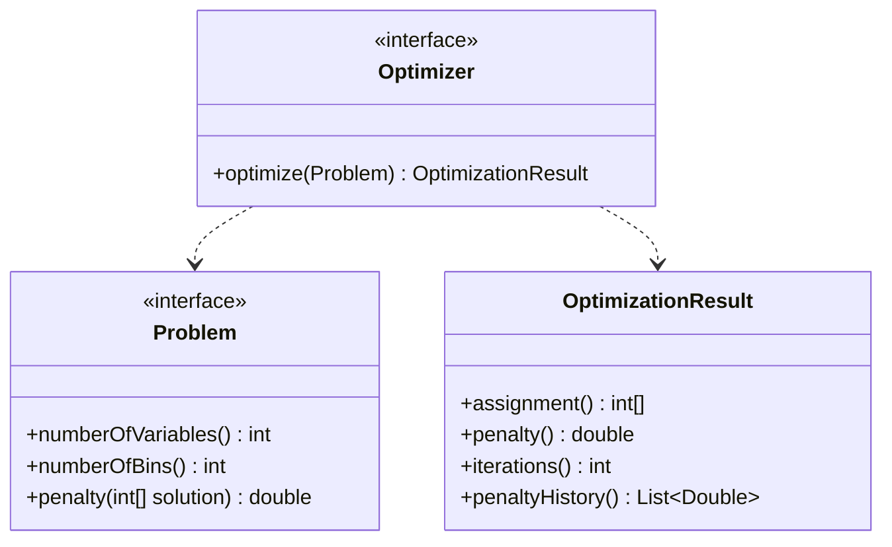
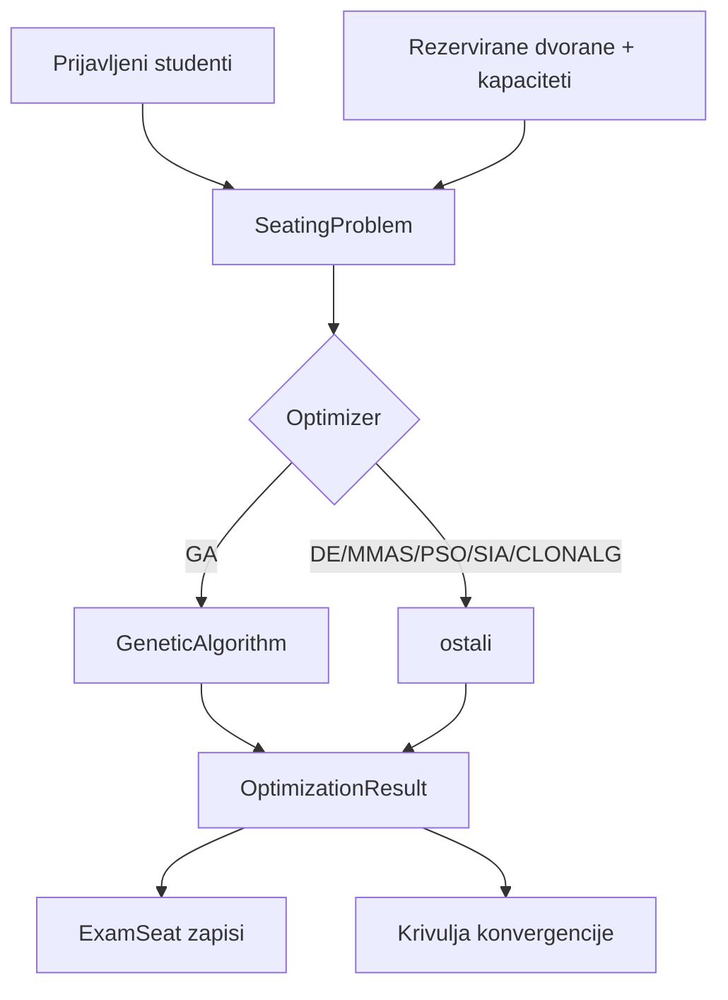

# Evolucijski mehanizam raspoređivanja

Modul `ferko-scheduling` implementira formalizam iz doktorske disertacije:

> **Marko Čupić (2011), _Raspoređivanje nastavnih aktivnosti evolucijskim računanjem_**, doktorski
> rad, Sveučilište u Zagrebu, Fakultet elektrotehnike i računarstva.

Modul je **čista Java**, bez Springa i bez ovisnosti o ostatku sustava — može se koristiti i kao
samostalna biblioteka. Aplikacijski sloj poziva ga kroz sučelje `Optimizer` u tri toka:
`ExamSchedulingService` za raspoređivanje studenata po dvoranama na ispitu;
`LectureTimetablingService` za evolucijsko generiranje tjednog rasporeda predavanja (model
`SimpleSchedulingProblem`: svaki se kolegij smješta u termin tako da se kolizije studenata — parovi
kolegija koji dijele studente — svedu na najmanju mjeru); te `ExamTimetablingService` za generiranje
rasporeda ispita (model `ExamTimetableProblem`: nijedan student ne piše dva ispita u istom terminu,
težinski po broju zajedničkih studenata), uz usporedbu s povijesnim (legacy) rasporedom.

## Apstrakcija

Rješenje je vektor cijelih brojeva (npr. „student *i* → dvorana *assignment[i]*”). `Problem`
definira **funkciju kazne** (manje = bolje; 0 = dopustivo rješenje), a `Optimizer` minimizira kaznu.
Determinističko sjeme čini izvođenje ponovljivim.

## Obitelji metaheuristika (pogl. 5)

| Algoritam | Klasa | Inspiracija |
|-----------|-------|-------------|
| Genetski algoritam (GA) | `GeneticAlgorithm` | evolucija, selekcija/križanje/mutacija |
| Diferencijska evolucija (DE) | `DifferentialEvolution` | diferencijske mutacije |
| Max-Min mravlji sustav (MMAS) | `MaxMinAntSystem` | feromonski tragovi |
| Optimizacija rojem čestica (PSO) | `ParticleSwarm` | rojno ponašanje |
| Jednostavni imunološki (SIA) | `ImmuneAlgorithm` | imunološki sustav |
| CLONALG | `Clonalg` | klonska selekcija |
| Paralelni otočni model | `IslandOptimizer` | paralelizacija (pogl. 6) |

Tvornica `Optimizers` stvara bilo koji algoritam po imenu uz jednak budžet i sjeme, što omogućuje
**pošten usporedni prikaz** u sučelju.

## Osam formalnih problema (pogl. 4)

| # | Problem | Klasa |
|---|---------|-------|
| 4.1 | Jednostavno raspoređivanje | `SimpleSchedulingProblem` |
| 4.2 | Neraspoređeni studenti po predavanjima | `UnscheduledStudentsProblem` |
| 4.3 | Uklanjanje konflikata u satnici | `ConflictRemovalProblem` |
| 4.4 | Raspored laboratorijskih vježbi | `LabSchedulingProblem` |
| 4.5 | Raspored provjera znanja (razmještaj) | `SeatingProblem` |
| 4.6 | Raspored prostorija za provjere | `ExamTimetableProblem` |
| 4.7 | Raspoređivanje timova | `TeamSchedulingProblem` |
| 4.8 | Prezentacijske grupe za seminare | `SeminarGroupsProblem` |

Primjer kazne (`SeatingProblem`): zbroj prekapacitiranosti svake dvorane podignut na potenciju
`α`, čime se kažnjava prelijevanje preko kapaciteta i forsira dopustiv razmještaj.

## Ispitni tok

Aplikacija nudi tri načina:

1. **`generateSeating(strategy)`** — odabrana strategija (genetski ili determinističke FERKO strategije
   punjenja: sortirano/slučajno × pohlepno/proporcionalno).
2. **`generateSeatingWith(algorithm)`** — bilo koja imenovana metaheuristika.
3. **`compareSeatingAlgorithms()`** — izvodi svih šest nad istim problemom (jednak budžet i sjeme),
   vraća kazne i krivulje konvergencije sortirane od najboljeg — temelj za „izbor algoritma”.

Rezultat (`SeatingResult`) sadrži dopustivost, kaznu i krivulju, koje sučelje prikazuje grafom.
