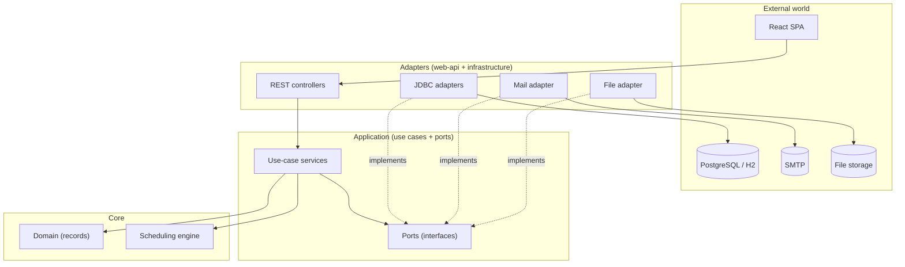
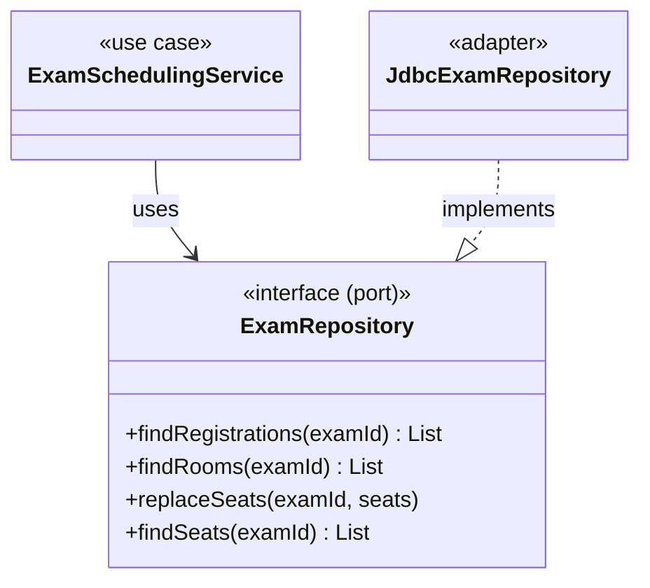
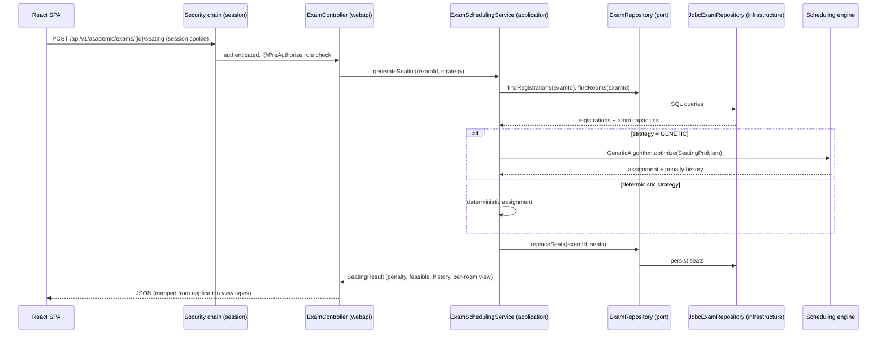

# Architecture

FERKO is a modernized academic portal for a university faculty. The backend is a Maven
multi-module project built around
**hexagonal architecture** (ports and adapters) and clean-architecture dependency rules:
business logic never depends on the framework, database, or transport. All dependencies point
**inward**, toward the domain.

## Modules

The backend (`backend/pom.xml`) is a reactor of seven modules. The base package for all of them
is `hr.fer.zemris.ferko`.

| Module | Role | May depend on |
|--------|------|---------------|
| `ferko-domain` | Pure domain model expressed as Java `record`s and POJOs. No framework dependencies whatsoever. | — |
| `ferko-scheduling` | Pure-Java evolutionary optimization engine: optimizers, problems, results. No framework dependencies. | — |
| `ferko-application` | Use-case services, **ports** (interfaces the outer layers implement), and view DTOs returned to callers. | `domain`, `scheduling` |
| `ferko-infrastructure` | JDBC adapters (port implementations), mail, and file storage. Uses the `JdbcIds` helper for identity-keyed inserts. | `application`, `domain` |
| `ferko-security` | Security boundary marker and supporting types. | `application`, `domain` |
| `ferko-web-api` | Spring Boot application: REST controllers, Flyway, bean wiring (`ApplicationBeans`), seeders, and the SPA served from the jar. | `application`, `infrastructure`, `security` |
| `ferko-architecture-tests` | ArchUnit fitness functions that enforce the module boundaries below. | — |



Use-case services are framework-free POJOs constructed with their port dependencies. They are
wired into Spring beans in a single place — `ApplicationBeans` (package `webapi.config`) — so the
application layer carries no Spring annotations.

## Module dependency rules (ArchUnit-enforced)

Boundaries are machine-checked by `ModuleDependencyRulesTest`
(`backend/ferko-architecture-tests`). The `verify` build fails on any violation. The allowed
direction:

```text
domain  <- application <- infrastructure
                       <- security
                       <- webapi
```

The enforced fitness rules:

1. `domain` must not depend on `application`, `infrastructure`, `security`, or `webapi`.
2. `application` must not depend on `infrastructure`, `security`, or `webapi`.
3. `infrastructure` must not depend on `webapi` or `security`.
4. `security` must not depend on `webapi` or `infrastructure`.
5. **`webapi` must not depend directly on `domain`** (the golden rule, see below).
6. Core packages (`hr.fer.zemris.ferko.*`) are free of cycles.

### The golden rule: web does not import domain

`..webapi..` never imports `..domain..`. Controllers work exclusively with application view and
use-case types; construction of domain objects happens inside the application layer (for example
`AcademicProvisioningService.provisionClassSchedule(...)` takes primitives and builds the domain
objects internally). DTO ↔ domain mapping lives in the web layer but only ever touches application
view types. The benefits:

- the web layer can change without touching the domain,
- the domain stays testable without any framework,
- persistence and transport details cannot leak into the API surface.

> Package-matching pitfall: the ArchUnit pattern `..security..` also matches `webapi.security`.
> Security classes that live in the web layer therefore reside in the package `webapi.auth`.

## Ports and adapters (example)



JDBC adapters share the `JdbcIds.insert(...)` helper (`ferko-infrastructure/adapter`), which runs
an insert against an identity-keyed table and returns the generated `id` via a `GeneratedKeyHolder`.

## Scheduling engine

`ferko-scheduling` is a self-contained, framework-free evolutionary engine implementing the formal
exam-scheduling model from Marko Cupic's doctoral dissertation (chapters 4.5 and 5.2). It exposes:

- An `Optimizer` abstraction and a `Problem` abstraction (fitness/penalty evaluation).
- Six metaheuristics, registered by name in `Optimizers`: `GENETIC`, `DIFFERENTIAL_EVOLUTION`,
  `MAX_MIN_ANT_SYSTEM`, `PARTICLE_SWARM`, `IMMUNE_ALGORITHM`, `CLONALG`, plus an `IslandOptimizer`
  that runs them in parallel and keeps the best result, and a memetic `HybridOptimizer` (`HYBRID`)
  that follows the parallel islands with a local-search refinement and is the hybrid exposed to operators.
- A family of problem definitions (`SeatingProblem`, `ExamTimetableProblem`, `LabSchedulingProblem`,
  `SeminarGroupsProblem`, `TeamSchedulingProblem`, `ConflictRemovalProblem`,
  `UnscheduledStudentsProblem`, `SimpleSchedulingProblem`).
- `OptimizationResult`, which carries the chosen assignment and a per-iteration penalty history so
  the UI can chart convergence.

The application layer (`ExamSchedulingService`) is the only consumer; the engine itself knows
nothing about exams, persistence, or HTTP.

## Representative request flow: exam seating generation

`POST /api/v1/academic/exams/{examId}/seating` (organizer roles only) generates a seating plan.



## Security

Two ordered Spring Security filter chains (`WebSecurityConfig`, package `webapi.config`):

1. **Session form-login chain** (`@Order(1)`) owns `/api/v1/auth/**` and `/api/v1/academic/**`.
   Authentication uses a `DaoAuthenticationProvider` with BCrypt password hashing and an
   HTTP-session-backed security context. Anonymous access to protected routes returns `401`.
2. **JWT / OIDC resource-server chain** (`@Order(2)`) is stateless and configurable for production
   identity (AAI@EduHr / OIDC). The `JwtDecoder` resolves from an issuer URI, a JWK-set URI, or an
   HMAC secret; the HMAC path can be disabled per profile (`allow-hmac-decoder=false` in
   `staging|prod`) so production must use a real IdP. SPA static assets and client routes are public;
   the SPA gates views by calling the session-protected APIs.

Method-level authorization (`@PreAuthorize`, enabled via `@EnableMethodSecurity`) protects
privileged actions. Coarse role checks guard each endpoint; row-level checks live in
`AccessControlService` (application layer) so that, for example, a student sees only the materials
of courses they are enrolled in. Login is rate-limited in the production profile.

## SPA served from the jar

The React single-page application is built and bundled into the backend jar at package time:

- `frontend-maven-plugin` installs Node/npm, runs `npm ci`, and builds the Vite bundle.
- `maven-resources-plugin` copies the build output into the jar's `static/` directory with
  `<overwrite>true</overwrite>`. The placeholder `index.html` shipped earlier in the build would
  otherwise survive and ship without the `<script>` tag, so overwrite is mandatory. CI guards this
  with a container smoke test that greps the served `index.html` for the `/assets/` bundle.
- `SpaForwardingController` forwards client-side routes (`/login`, `/kolegiji/**`, `/prostorije`,
  `/studenti`) to `index.html` so deep links and browser refreshes resolve to the SPA. The root path
  and static assets use Spring Boot's default static handling; REST, actuator, and API-docs paths
  keep their own controllers.

The frontend stack is React 18 + TypeScript + Vite, with TanStack Query for data fetching and
React Router for routing; it authenticates via the session cookie.

## Configuration and profiles

FERKO-specific configuration is consolidated into a single typed source, `FerkoProperties`
(`@ConfigurationProperties(prefix = "ferko")`), which replaces scattered `@Value` injections. It
groups every tunable behaviour into nested sections:

- **`ferko.seed`** — demo-user and academic dataset seeding (`enabled`, `max-courses`,
  `max-students`); consumed by the bootstrap seeders (`AcademicUserSeeder`, `AcademicDataSeeder`,
  `GradeSeeder`).
- **`ferko.grading`** — default grade thresholds (`excellent`, `very-good`, `good`, `sufficient`)
  applied when a course defines none.
- **`ferko.scheduler`** — default metaheuristic budget (`default-population-size`,
  `default-iterations`, `default-seed`).
- **`ferko.mail`** — outbound e-mail (`enabled`, `from`); SMTP host/port live under `spring.mail.*`.
- **`ferko.security`** — JWT/OIDC claims and decoder, the dev-token toggle, and login rate-limit
  settings.

All values are overridable through environment variables (`FERKO_*`) and `application.yml`;
`FerkoProperties` is the typed binding, not a competing source of truth. The properties are also
surfaced read-only to administrators (`SettingsController`).

Spring profiles select the runtime shape:

- **default** — local development against H2 in PostgreSQL compatibility mode; HMAC JWT decoding is
  permitted for convenience.
- **docker** — PostgreSQL (`jdbc:postgresql://postgres:5432/ferko`) via `docker compose`.
- **staging | prod** — PostgreSQL with OIDC-first security: HMAC decoding is disabled, so a real
  issuer (`FERKO_OIDC_ISSUER_URI`) or JWK-set URI is required.

## Persistence and migrations

Schema changes are applied by Flyway from `ferko-web-api/src/main/resources/db/migration`. Rules:

- Migrations are immutable once merged; every schema change is a new `V{n}` file.
- Migrations must be portable across H2 (PostgreSQL mode, used by dev and tests) and PostgreSQL:
  use `bigint generated by default as identity` (not `bigserial`), `current_timestamp` (not
  `now()`), no `DESC` in indexes; `text` is fine.
- The same table must be added to
  `ferko-infrastructure/src/test/resources/academic-schema-h2.sql` so infrastructure adapter tests
  run against an equivalent H2 schema.

## Conventions

- Base package: `hr.fer.zemris.ferko`.
- DTO ↔ domain mapping happens in the web layer, but the web layer only ever references application
  view types — never domain types directly.
- UI text is Croatian; i18n keys are maintained in both Croatian and English.
- Every module that introduces new code carries its own tests: the application module uses in-memory
  fakes, the infrastructure module uses H2 adapter tests, and the web module uses Spring Boot tests.
