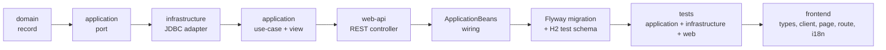

# Contributing

FERKO is built in small, complete **vertical slices**: every feature passes through all layers and
ships with tests, so that `master` always stays green and deployable.

## Vertical slice

A new module or feature flows through the layers in this order:



Concretely:

1. **Domain** — add an immutable `record` in `ferko-domain` (no dependencies).
2. **Port** — declare the persistence interface in `ferko-application/port`.
3. **Adapter** — implement it with JDBC in `ferko-infrastructure/adapter`, using the `JdbcIds`
   helper for generated keys (mirror an existing adapter such as `JdbcNoticeRepository`).
4. **Use-case + view** — add the service and view DTOs in `ferko-application/usecase/<module>`.
5. **REST controller** — add the endpoint in `ferko-web-api/controller`; map DTO ↔ domain in the
   web layer (the web layer never imports the domain directly).
6. **Wiring** — register the beans in `ApplicationBeans`.
7. **Migration** — add `V{n}__*.sql` under `db/migration` **and** mirror the table into
   `ferko-infrastructure/src/test/resources/academic-schema-h2.sql`.
8. **Tests** — application (in-memory fakes), infrastructure (H2 adapter test), and a web
   `@SpringBootTest`.
9. **Frontend** — `api/types.ts`, `api/client.ts`, a page in `pages/`, a route in `App.tsx`,
   navigation/links, and i18n keys in **both** the Croatian and English dictionaries.

## Verification

The project targets Java 21; build inside a container so the local JDK never matters.

```bash
# Fast frontend check (TypeScript + Vite):
cd frontend && docker run --rm -v "$PWD":/app -w /app node:20.18.0 \
  bash -lc 'npm ci || npm i; npm run build'

# Full quality gate (format, checkstyle, tests, coverage, ArchUnit):
docker run --rm -v "$PWD":/workspace -v ferko-m2:/root/.m2 -w /workspace \
  maven:3.9.9-eclipse-temurin-21 bash -lc './mvnw -B -ntp spotless:apply; ./mvnw -B -ntp verify'
```

The gate enforces Spotless formatting, Checkstyle, JaCoCo (70% line coverage per module), and the
ArchUnit module-boundary rules. Open a pull request against `master` with a clean, descriptive
message; merge by squash once CI is green.

## Conventions

- Base package: `hr.fer.zemris.ferko`.
- The web layer maps DTOs to/from domain types and **never imports the domain** (ArchUnit-enforced);
  construct domain objects in the application layer.
- Flyway migrations are immutable after merge; a new schema change is a new `V{n}` and must be
  mirrored into the H2 test schema. Keep migrations portable across PostgreSQL and H2 (PostgreSQL
  mode): `bigint generated by default as identity` (not `bigserial`), `current_timestamp` (not
  `now()`), no `DESC` in indexes, `text` is fine.
- UI text is Croatian; i18n keys are maintained in both the Croatian and English dictionaries.
- Configuration lives in one place: the typed `FerkoProperties` (`@ConfigurationProperties` with
  the `ferko` prefix), overridable through `FERKO_*` environment variables.
- When a slice adds a user-facing feature, a route, or a schema change, update the documentation
  (README, `docs/architecture/*`, `docs/user-guide.md`) in the same change.
