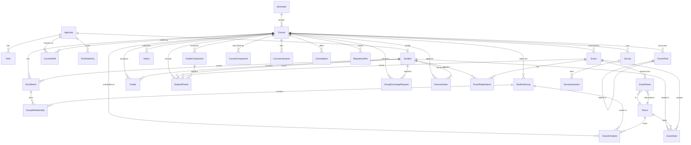

# FERKO Domain Model

This document describes the persistent domain of FERKO, a modernized rewrite of the FER
academic portal. The domain layer (`backend/ferko-domain`) is pure Java (immutable
`record` types, no framework dependencies); persistence is driven by Flyway migrations
under `backend/ferko-web-api/src/main/resources/db/migration`. This document is kept in
sync with both.

The architecture is hexagonal: domain records carry no behaviour beyond their data,
application services orchestrate use cases through ports, and JDBC adapters in the
infrastructure module map records to the relational schema described below.

## Entity-relationship diagram

The diagram covers the academic core plus the portal services. Relationship cardinalities
reflect the foreign keys declared in the migrations.

## Entities by area

### Academic core

- **AppUser** `(id, username, passwordHash, fullName, email, active, createdAt, roles)` —
  authentication principal and identity; `roles` is a `Set<Role>`.
- **Role** — enum: `STUDENT`, `NASTAVNIK`, `NOSITELJ`, `ASISTENT`, `ASISTENT_ORGANIZATOR`,
  `STUSLU`, `ADMIN`.
- **Student** `(id, userId, jmbag, studyProgram, yearOfStudy)` — student profile linked to
  an `AppUser`.
- **Semester** `(code, academicYear, term, startsOn, endsOn, active)` — academic period;
  `code` is the natural key.
- **Course** `(id, code, name, semesterCode, ects, description, literature)` — a course
  offering within a semester.
- **CourseStaff** `(id, courseId, userId, role)` — assignment of a user to a course in a
  teaching role.
- **StudentGroup** `(id, courseId, groupCode, type, category, capacity)` — lab/exercise
  cohort; `type` is a `GroupType`.
- **Enrollment** `(id, studentId, courseId, enrolledAt, status)` — a student's enrollment;
  `status` is an `EnrollmentStatus`.
- **GroupMembership** `(id, enrollmentId, groupId)` — links an enrollment to a student
  group.
- **Room** `(id, code, building, capacity, requiredAssistants, hasComputers)` — physical
  teaching/exam space.
- **ClassSchedule** `(id, courseId, groupId, type, roomId, dayOfWeek, startsAt, endsAt, instructor)` —
  recurring weekly class slot.

### Assessments and scheduling

- **Exam** `(id, courseId, title, shortName, kind, startsAt, durationMinutes, maxPoints, ordinal, visibility, locked, prerequisiteFlagId)` —
  an exam event; `kind` is `ExamKind`, `visibility` is `ExamVisibility`.
- **ExamRegistration** `(id, examId, studentId, registeredAt, status)` — a student's
  registration for an exam.
- **ExamRoom** `(id, examId, roomId, capacity, requiredAssistants, reserved)` — a room
  allocated to an exam.
- **ExamSeat** `(id, examId, studentId, roomId, seatNo, testGroup)` — seat assignment
  produced by the scheduling engine.
- **Grade** `(id, courseId, studentId, finalGrade, pointsTotal, decidedBy, ...)` — final
  per-course grade for a student.
- **GradeComponent** `(id, courseId, name, shortName, maxPoints, ordinal)` — a weighted
  grading component definition.
- **StudentPoints** `(id, courseId, studentId, componentId, examId, points, maxPoints, published, enteredBy, ...)` —
  points earned against a grade component or exam.

### Portal services

- **Notice** `(id, courseId, title, body, authorName, createdAt, pinned)` — course or
  global announcement; `courseId` is nullable for global notices.
- **Survey** `(id, courseId, title, active, createdAt)` — course survey.
- **SurveyQuestion** `(id, surveyId, text, ordinal)` — a question within a survey.
- **ForumPost** `(id, courseId, parentId, authorName, body, createdAt)` — course forum
  message; `parentId` self-references for threaded replies.
- **CourseComponent** `(id, courseId, title, content, ordinal, visible)` — a rich-text
  section of the course page.
- **CourseLiterature** `(id, courseId, title, author, mandatory, ordinal)` — a literature
  reference.
- **Consultation** `(id, courseId, staffName, dayOfWeek, startsAt, endsAt, location)` —
  staff office-hours slot.
- **RepositoryFile** `(id, courseId, filename, contentType, sizeBytes, storageKey, uploadedBy, uploadedAt)` —
  course file attachment metadata.
- **GroupExchangeRequest** `(id, courseId, studentId, fromGroupId, toGroupId, status, reason, decidedBy, createdAt, decidedAt)` —
  request to switch student groups; `status` is `ExchangeStatus`.
- **PortfolioEntry** `(id, userId, title, description, category, link, createdAt)` —
  e-portfolio item owned by a user.
- **Demonstrator** `(id, courseId, studentId)` — a student appointed as course
  demonstrator.
- **AcademicAuditEvent** `(id, occurredAt, actor, action, entityType, entityId, details)` —
  audit record of administrative actions.

### Supporting enums

`GroupType`, `EnrollmentStatus`, `ExamKind`, `ExamVisibility`, `ExamFlag`,
`ExchangeStatus`, `CourseCode`.

## Flyway migrations

Migrations are applied in version order at startup. The current head is **V15**.

| Version | File                                     | Purpose                                             |
| ------- | ---------------------------------------- | --------------------------------------------------- |
| V1      | `V1__create_todo_tasks.sql`              | To-do tasks (first vertical slice)                  |
| V2      | `V2__create_todo_audit_log.sql`          | Audit log for to-do tasks                           |
| V3      | `V3__create_legacy_bootstrap_tables.sql` | Legacy bootstrap tables                             |
| V4      | `V4__create_academic_core.sql`           | Users, students, semesters, courses, staff, groups, enrollments, rooms |
| V5      | `V5__create_assessments_and_scheduling.sql` | Exams, exam rooms/seats, grade components, grades, points |
| V6      | `V6__create_notices.sql`                 | Notices / announcements                             |
| V7      | `V7__create_surveys.sql`                 | Surveys and survey questions                        |
| V8      | `V8__create_forum.sql`                   | Course discussion forum                             |
| V9      | `V9__create_course_components.sql`       | Rich-text course page components                    |
| V10     | `V10__create_repository_files.sql`       | Course file repository metadata                     |
| V11     | `V11__create_exam_room_assistants.sql`   | Assistant assignments per exam room                 |
| V12     | `V12__create_course_literature.sql`      | Course literature references                        |
| V13     | `V13__create_consultations.sql`          | Staff consultation (office-hours) slots             |
| V14     | `V14__create_eportfolio.sql`             | E-portfolio entries                                 |
| V15     | `V15__create_demonstrators.sql`          | Course demonstrators                                |

## Migration policy

- **Immutable after merge.** Once a migration is merged it is never edited. Any schema
  change is a brand-new `V{n}` migration with the next sequential version.
- **Mirror every table** added or altered into
  `backend/ferko-infrastructure/src/test/resources/academic-schema-h2.sql`, so JDBC adapter
  tests run against an equivalent schema.
- **Portability** (the same DDL must run on H2 in PostgreSQL mode and on PostgreSQL):
  - Use `bigint generated by default as identity` for surrogate keys, never `bigserial`.
  - Use `current_timestamp`, never `now()`.
  - Do not use `DESC` inside an index definition.
  - `text` columns are fine and preferred for variable-length strings.

Keeping the records, the migrations, and the H2 mirror in agreement is part of every
vertical slice; update this document whenever a slice introduces a new table, column, or
relationship.
