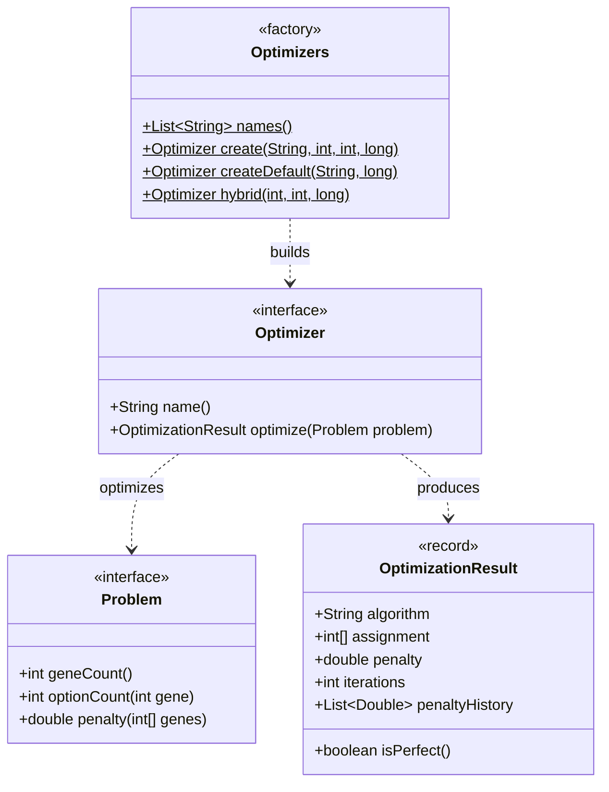

# Scheduling Engine

The `ferko-scheduling` module is FERKO's evolutionary scheduling engine. It implements the
formalism from the doctoral thesis:

> **Marko Čupić (2011)**, _Raspoređivanje nastavnih aktivnosti evolucijskim računanjem_
> (Scheduling of teaching activities by evolutionary computation), doctoral thesis.

The module is **pure Java** — no Spring, no dependency on the rest of the system — and can be used
as a **standalone library**. The application layer consumes it only through the small `Optimizer`
and `Problem` interfaces, which keeps the metaheuristics fully decoupled from FERKO's domain.

## The abstraction

Every concrete scheduling task is modelled as a discrete assignment `Problem`: a solution is an
`int[]` of `geneCount()` genes, where gene `i` holds an option index in `[0, optionCount(i))`. The
single objective is the non-negative `penalty(int[])`, where lower is better and `0` denotes a
perfect (conflict-free, feasible) solution. Any `Optimizer` searches this space and returns an
`OptimizationResult`. Because every algorithm and every problem speaks this one contract, all
metaheuristics are interchangeable and directly comparable on identical input.

`Optimizers` is the registry/factory: callers (scheduling jobs and the UI) select and compare
algorithms by stable name without depending on concrete classes. `createDefault` uses a sensible
budget (population 60, 5000 iterations); `hybrid` builds a `HybridOptimizer` (parallel islands over
every algorithm, then local refinement); `selectable` lists the base algorithms plus `HYBRID`.

## Metaheuristics

`Optimizers.names()` exposes six interchangeable metaheuristics. Each is **deterministic for a fixed
seed**, so runs are reproducible and comparisons are fair.

| Name | Algorithm | Notes |
| --- | --- | --- |
| `GENETIC` | Steady-state (elimination) genetic algorithm | Per Čupić's thesis: each step draws three random individuals, eliminates the worst, and replaces it with the mutated uniform crossover of the other two. |
| `DIFFERENTIAL_EVOLUTION` | Differential Evolution (DE/rand/1/bin) | Continuous encoding decoded by floor-and-clamp; donor `pop[r1] + F·(pop[r2] − pop[r3])`, binomial crossover, greedy selection. |
| `MAX_MIN_ANT_SYSTEM` | MAX-MIN Ant System | Pheromone matrix `tau[gene][option]` biases each ant's choice; evaporation, best-so-far reinforcement, trails clamped to `[tauMin, tauMax]` (Stützle & Hoos). |
| `PARTICLE_SWARM` | Particle Swarm Optimization | Continuous relaxation; velocity with inertia plus cognitive/social attraction; positions decoded by floor-and-clamp. |
| `IMMUNE_ALGORITHM` | Simple Immune Algorithm (SIA) | Each antibody is cloned, clones mutate per-gene, the best of old ∪ clones survive, remaining slots refilled with fresh antibodies (metadynamics). |
| `CLONALG` | CLONALG clonal selection | Better-ranked antibodies are cloned more heavily and hypermutated less; worst antibodies replaced by fresh ones each iteration. |

In addition, **`IslandOptimizer`** (`name() == "PARALLEL_ISLAND"`) is a coarse-grained parallel
hybrid: it runs several independent optimizers concurrently and keeps the best solution across all
of them. This realises the population-/algorithm-level parallelization of chapter 6 of the thesis
and works with any mix of optimizers (several seeds of one algorithm, or all six families).

**`HybridOptimizer`** (`name() == "HYBRID"`) is the memetic combination exposed to operators: it runs
all six families as islands (via `IslandOptimizer`), migrates out the best elite, then **intensifies**
it with greedy single-gene hill-climbing until no local move improves the penalty. This pairs global
exploration with local exploitation. `Optimizers.hybrid(...)` builds it, `Optimizers.selectable()`
lists it alongside the six base algorithms for the generation UI, and the lecture/exam timetabling
services accept `"HYBRID"` as the requested algorithm.

## Problem catalogue

Eight `Problem` implementations cover the scheduling tasks formalised in the thesis. Each maps a
real constraint set onto the generic gene/penalty contract; thesis sections below are taken from the
class javadoc.

| Problem | Thesis | What it models |
| --- | --- | --- |
| `SimpleSchedulingProblem` | 4.1 | Assign each of `N` activities to one of `T` time slots; penalty counts conflicting activity pairs (sharing a resource) placed in the same slot. |
| `UnscheduledStudentsProblem` | 4.2 | Assign (student, course) enrolments to lecture groups; soft non-linear over-capacity penalty plus a dominating hard penalty for a student's time-overlap. |
| `ConflictRemovalProblem` | 4.3 | Re-assign group choices to remove student timetable conflicts while minimising (non-linearly) the number of edits, preferring to change only conflicted genes. |
| `LabSchedulingProblem` | 4.4 | Place lab events into slots; squared over-use penalties for room-capacity overflow and shared limited-resource (e.g. licence) overuse. |
| `SeatingProblem` | over-capacity model | Assign students to exam rooms; penalty is the non-linearly weighted room over-capacity `Σ max(0, load − capacity)^alpha`. |
| `ExamTimetableProblem` | exam-timetable objective | Place each exam in a slot; penalty is the count of (student, exam-pair) conflicts from two shared-student exams sharing a slot. |
| `TeamSchedulingProblem` | 4.7 | Partition `N` people into `K` size-bounded teams; squared penalties for size violations and per-team workload imbalance. |
| `SeminarGroupsProblem` | 4.8 | Form seminar presentation groups; dominating hard penalty for group over-capacity plus a soft topic-preference cost. |

`SeatingStrategies` complements `SeatingProblem` with four deterministic seat-fillers mirroring the
FERKO buttons (sorted/random students × greedy/proportional room filling), used as fast baselines
against the metaheuristic.

## Application consumers

Three application services in `ferko-application/.../usecase` adapt the engine to FERKO workflows.
Each translates domain data into a `Problem`, runs an `Optimizer`, and maps the assignment back.

### 1. `ExamSchedulingService` — exam-room seating

Orchestrates the assessment workflow (define exam, reserve rooms, register students) and produces
the seating. Students are seated into reserved rooms via `SeatingProblem` with an over-capacity
exponent `alpha = 2`. `generateSeating(...)` can use one of the deterministic `SeatingStrategies`
or the genetic optimiser; `generateSeatingWith(examId, algorithm)` runs any named metaheuristic and
persists the result. `compareSeatingAlgorithms(examId)` runs **every** supported metaheuristic over
the same seating problem with an identical budget and seed, records each one's penalty, iterations,
elapsed time and convergence curve, sorts them best-first, and returns them **without persisting** —
the FERKO "algorithm choice + side-by-side view".

### 2. `LectureTimetablingService` — weekly lecture timetable

Generates a conflict-minimising weekly lecture timetable on demand. Each course in scope is mapped
to one gene whose value is a weekly period, modelled with `SimpleSchedulingProblem`; the conflict
matrix marks a pair of courses as conflicting when they **share at least one student**. The weekly
grid is six two-hour blocks per day across five working days. Scope is chosen per study year
(`coursesForStudyYear`) or as an explicit course set. `generate(...)` reports the assignment, the
**all-in-one-slot baseline** conflict count, the achieved penalty, whether the schedule is perfect,
the iteration count, and the convergence (`penaltyHistory`). `compare(...)` runs all six
metaheuristics on the same problem and returns each result sorted by fewest conflicts.

### 3. `ExamTimetablingService` — exam timetable vs. legacy

Generates a conflict-minimising exam timetable via `ExamTimetableProblem`. Each course's exam is a
gene whose value is an exam slot; the conflict weight between two exams is the **number of shared
students** (so larger overlaps are penalised more). `generate(...)` builds the weighted shared-
student matrix, runs the chosen optimizer, and reports the assignment, the all-in-one-slot baseline,
the achieved penalty, convergence, and — when a `legacyAssignment` (courseId → historical slot) is
supplied — the weighted conflict count of the **historical schedule** (`raspored-final`) computed on
the same cohort, so the generated timetable can be measured directly against the legacy one.

## Quality and benchmarking

The engine is designed to be measured, not trusted blindly:

- **Per-algorithm comparison.** The `compare`/`compareSeatingAlgorithms` paths run every
  metaheuristic on identical input with a shared budget and fixed seed, surfacing each algorithm's
  conflict count (penalty), iterations actually performed, elapsed wall-clock time, a perfect-solution
  flag, and the full `penaltyHistory` convergence curve. Results are sorted best-first so the UI can
  show which family wins on a given instance.
- **Baseline reduction.** Both timetabling services report the naive all-in-one-slot baseline
  alongside the optimised penalty, making the conflict reduction explicit.
- **Legacy comparison.** Exam-timetable generation compares its weighted shared-student conflict
  count against the historical schedule on the same cohort, quantifying the improvement over the
  legacy `raspored-final`.
- **Reproducibility.** Every optimizer is deterministic for a fixed seed, so benchmarks and tests
  are repeatable; the module has its own test suite (`ferko-scheduling/src/test`) covering each
  optimizer and each problem's penalty semantics.

Source files: engine in `backend/ferko-scheduling/src/main/java/hr/fer/zemris/ferko/scheduling/`;
consumers in `backend/ferko-application/src/main/java/hr/fer/zemris/ferko/application/usecase/`
(`exam/ExamSchedulingService`, `timetable/LectureTimetablingService`,
`timetable/ExamTimetablingService`).
