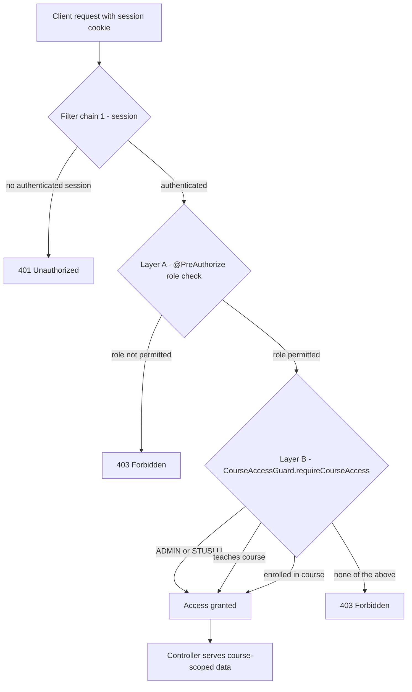

# FERKO Security Model

This document describes how FERKO authenticates requests and authorizes access to academic
resources. It consolidates the authorization model that the project grew across its slices: the two
Spring Security filter chains, the role taxonomy, the two layers of authorization (coarse role
checks and row-level course access), and the resulting role-to-visibility matrix.

## Overview

FERKO runs two independent Spring Security filter chains in one application:

1. A **session / form-login chain** (`@Order(1)`) that owns the browser-facing academic API. It uses
   an HTTP session cookie and BCrypt-hashed passwords.
2. A **JWT / OIDC resource-server chain** (`@Order(2)`) that owns the ToDo API and the static SPA. It
   is stateless and validates bearer tokens against a configurable issuer or HMAC secret.

Method security is enabled globally (`@EnableMethodSecurity`), so controllers can attach
`@PreAuthorize` expressions on individual endpoints. Authorization then layers on top of
authentication in two steps: a coarse role check, and where the resource is a specific course, a
row-level access check.

All security wiring lives in
`backend/ferko-web-api/src/main/java/hr/fer/zemris/ferko/webapi/config/WebSecurityConfig.java`.

## Filter chain 1 — session / form login (`@Order(1)`)

- **Matches:** `/api/v1/auth/**` and `/api/v1/academic/**`.
- **Authentication:** username and password validated by a `DaoAuthenticationProvider` backed by
  `FerkoUserDetailsService`. Passwords are stored and compared with `BCryptPasswordEncoder`.
- **Session:** `SessionCreationPolicy.IF_REQUIRED`; the authenticated principal is persisted via an
  `HttpSessionSecurityContextRepository`, so the client carries a session cookie on subsequent
  requests.
- **Public surface:** only `POST /api/v1/auth/login` is permitted anonymously. Every other request
  on this chain requires authentication (`anyRequest().authenticated()`).
- **Unauthenticated response:** a `HttpStatusEntryPoint(HttpStatus.UNAUTHORIZED)` returns `401`
  rather than redirecting to a login page (the SPA handles login UI itself).
- Form login, HTTP Basic, and logout are explicitly disabled; the SPA drives the auth flow through
  the JSON endpoints.
- CSRF is currently disabled on this chain. Enabling cookie-based CSRF tokens for the SPA is a known
  follow-up that touches the whole security chain and is tracked as outstanding.

This is the chain that protects all of the academic functionality (courses, grading, exams, files,
timetables, administration).

## Filter chain 2 — JWT / OIDC resource server (`@Order(2)`)

- **Matches:** everything not claimed by chain 1, primarily `/api/v1/todo/**` and the static SPA
  assets and client-side routes.
- **Session:** `STATELESS`; authentication is derived per request from a bearer token.
- **Public surface:** the SPA shell and assets (`/`, `/index.html`, `/styles.css`, `/app.js`,
  `/favicon.svg`), liveness endpoints (`/api/v1/ping`, `/actuator/health`, `/actuator/info`), the
  OpenAPI and Swagger UI resources, the dev token mint endpoint (`POST /api/v1/dev/token`), and all
  remaining static SPA routes are public. The SPA itself gates views by calling the
  session-protected academic APIs, so a public asset never exposes protected data.
- **Protected ToDo endpoints:**
  - `GET /api/v1/todo/my`, `GET /api/v1/todo/assigned` require `SCOPE_todo.read` or `ROLE_TODO_READ`.
  - `POST /api/v1/todo/tasks`, `POST /api/v1/todo/tasks/*/close` require `SCOPE_todo.write` or
    `ROLE_TODO_WRITE`.
- **Token validation (`JwtDecoder`):** resolved in priority order from configuration:
  1. `FERKO_OIDC_ISSUER_URI` — full OIDC issuer discovery (preferred for production).
  2. `FERKO_OIDC_JWK_SET_URI` — JWK set URL.
  3. `FERKO_JWT_HMAC_SECRET` — symmetric HS256 key, intended for local development and tests.
- **HMAC guard:** the HMAC decoder is only built when `FERKO_JWT_ALLOW_HMAC_DECODER` is `true`. The
  default profile leaves it `true`, but the **production profile sets it to `false`**, so a prod
  deployment must configure a real OIDC issuer or JWK set URI; attempting to start with only an HMAC
  secret fails fast.
- **Roles from the token:** `jwtAuthenticationConverter` reads scopes plus a configurable roles
  claim (`FERKO_JWT_ROLES_CLAIM`, default `roles`). Each role is normalized (trimmed, upper-cased,
  `-`/space to `_`) and prefixed with `ROLE_` so it can be matched by `@PreAuthorize` and by the
  row-level guard.
- **Auditing of denials:** a `ToDoSecurityAuditHandler` serves as both the authentication entry
  point and the access-denied handler on this chain, recording privileged access failures into the
  audit log.

## Roles

FERKO models seven roles. Names are stored without the `ROLE_` prefix in the domain and gain the
prefix as Spring authorities.

| Role | Description |
| --- | --- |
| `STUDENT` | Enrolled student. Sees only the courses they attend and their own data (grades, exams, demonstrator duties). |
| `NASTAVNIK` | Teacher on a course. Can manage grading (points, grades, components) for the courses they teach, but does not organise exams. |
| `NOSITELJ` | Course holder ("nositelj kolegija"). Full grading authority plus exam organisation for their course. |
| `ASISTENT` | Teaching assistant. Can manage grading for their course; not an exam organiser. |
| `ASISTENT_ORGANIZATOR` | Organising assistant. Grading plus exam-organisation duties (seating, invigilators) for their course. |
| `STUSLU` | Student services ("studentska sluzba"). Faculty-wide visibility of student and enrollment data; handles enrollments. Not a grading or exam-organisation role. |
| `ADMIN` | Administrator. Faculty-wide authority over courses, users, semesters, timetable generation, and audit. |

## Two layers of authorization

### Layer A — coarse role checks (`@PreAuthorize`)

Endpoints declare the set of roles permitted to call them. Controllers define reusable expression
constants so the intent is consistent. The four recurring sets are:

- **STAFF** (read student/enrollment data):
  `hasAnyRole('ADMIN', 'STUSLU', 'NOSITELJ', 'NASTAVNIK', 'ASISTENT_ORGANIZATOR', 'ASISTENT')`
- **Grading-manage**:
  `hasAnyRole('ADMIN', 'NOSITELJ', 'NASTAVNIK', 'ASISTENT_ORGANIZATOR', 'ASISTENT')`
- **Exam-organiser**:
  `hasAnyRole('ADMIN', 'NOSITELJ', 'ASISTENT_ORGANIZATOR')`
- **Admin-only**: `hasRole('ADMIN')` (or, for a few endpoints, with `STUSLU` / `NOSITELJ`).

### Layer B — row-level course access (`AccessControlService` via `CourseAccessGuard`)

A role check answers "is this kind of user allowed here?" but not "is this *particular* user related
to *this* course?". That question is answered by
`backend/ferko-application/src/main/java/hr/fer/zemris/ferko/application/usecase/access/AccessControlService.java`.

`canAccessCourse(username, roles, courseId)` returns true when:

1. the user holds a **global role** (`ADMIN` or `STUSLU`) — faculty-wide visibility, no per-course
   check; otherwise
2. the user **teaches** the course (appears in the course staff), or
3. the user is a **student enrolled** in the course.

`CourseAccessGuard.requireCourseAccess(authentication, courseId)`
(`backend/ferko-web-api/.../controller/CourseAccessGuard.java`) is the web-layer adapter: it pulls
the `ROLE_`-prefixed authorities off the `Authentication`, strips the prefix, delegates to
`AccessControlService`, and throws `403` when access is denied. It is invoked explicitly by the
controllers that serve course-scoped content which annotations cannot express (course files,
demonstrators). For example, `RepositoryController` calls the guard on listing and download so a
student can only reach material for a course they attend, and a teacher only for a course they teach.

## Role-to-visibility matrix

The matrix below reflects the exact `@PreAuthorize` sets and row-level guards found in the
controllers. "Row-level" means the listed roles also pass through `CourseAccessGuard`, so they must
additionally teach or be enrolled in the course (global roles bypass that check).

| Capability / endpoint group | Controller | STUDENT | NASTAVNIK | NOSITELJ | ASISTENT | ASISTENT_ORGANIZATOR | STUSLU | ADMIN |
| --- | --- | :-: | :-: | :-: | :-: | :-: | :-: | :-: |
| Semesters, weekly timetable | Academic/Timetable | yes | yes | yes | yes | yes | yes | yes |
| Course listing + course detail | `AcademicController` (scoped + row-level) | own\* | teach\* | teach\* | teach\* | teach\* | yes | yes |
| Room catalogue | `AcademicController` (`STAFF`) | no | yes | yes | yes | yes | yes | yes |
| Student roster, single student, course enrollments | `AcademicController` (`STAFF`) | no | yes | yes | yes | yes | yes | yes |
| Gradebook: components, points, points-overview, grades | `GradingController` (grading-manage) | no | yes | yes | yes | yes | no | yes |
| Auto-grade exam submissions | `ExamGradingController` (grading-manage) | no | yes | yes | yes | yes | no | yes |
| Notices: publish | `NoticeController` (`CAN_PUBLISH`) | no | yes | yes | no | yes | yes | yes |
| Notices: delete | `NoticeController` (`CAN_PUBLISH` + row-level) | no | yes\* | yes\* | no | yes\* | yes | yes |
| Exam organisation: create exam, reserve rooms, register, seating, publish, invigilators, seating/invigilator views | `ExamController` (exam-organiser) | no | no | yes | no | yes | no | yes |
| Course files: upload | `RepositoryController` (grading-manage + row-level) | no | yes\* | yes\* | yes\* | yes\* | no | yes |
| Course files: list, download | `RepositoryController` (row-level) | yes\* | yes\* | yes\* | yes\* | yes\* | yes | yes |
| Demonstrators: list | `DemonstratorController` (row-level) | yes\* | yes\* | yes\* | yes\* | yes\* | yes | yes |
| Demonstrators: assign, remove | `DemonstratorController` (exam-organiser + row-level) | no | no | yes\* | no | yes\* | no | yes |
| My data: my exams + registration, my demonstrator duties | Student/Demonstrator (`/my/**`) | own | own | own | own | own | own | own |
| Timetable generation, collisions, compare | `TimetableController` (admin-only) | no | no | no | no | no | no | yes |
| Exam-timetable generation | `ExamTimetableController` (admin-only) | no | no | no | no | no | no | yes |
| Create course, list users, sync status, create semester | `AcademicAdminController` (admin-only) | no | no | no | no | no | no | yes |
| Enroll student into course | `AcademicAdminController` | no | no | no | no | no | yes | yes |
| Assign student to group | `AcademicAdminController` | no | no | yes | no | no | yes | yes |
| Assign course staff | `AcademicAdminController` | no | no | yes | no | no | no | yes |
| Audit log (recent privileged actions) | `AuditController` (admin-only) | no | no | no | no | no | no | yes |

\* Row-level: subject to `CourseAccessGuard` — the role is necessary but the user must also teach or
be enrolled in the specific course. `ADMIN` and `STUSLU` bypass the row-level check via the global
roles. The course listing is scoped the same way by `AcademicQueryService.listCoursesForPrincipal`:
a student sees only the courses they attend ("own"), teaching staff see only the courses they teach
("teach"), and global roles see the full catalogue, so a student never enumerates every course.

`/my/**` endpoints resolve data from the authenticated principal (`authentication.getName()`), so
every authenticated user sees only their own exams, registrations, and demonstrator duties.

Notice deletion is row-level via `AccessControlService.canManageCourse` (teaching staff or a global
role, never an enrolled student): a course notice may be deleted by `ADMIN`/`STUSLU` or staff
teaching that course, while a faculty-wide notice (no course) may be deleted only by `ADMIN`/`STUSLU`.
Each `NoticeView` carries a per-user `canDelete` flag so the UI shows the delete action only where
the request would succeed.

## Why exam organisation is narrower than grading

Grading is a routine teaching activity, so every teaching role on a course can enter points and
grades (`NASTAVNIK`, `ASISTENT`, `ASISTENT_ORGANIZATOR`, `NOSITELJ`, plus `ADMIN`). Exam
organisation — creating exams, reserving rooms, generating seating, assigning invigilators, and the
read-only seating and invigilator views that reveal where each student is placed — is a coordination
duty with broader consequences and access to sensitive placement data. It is therefore restricted to
the organiser level: the course holder (`NOSITELJ`), the organising assistant
(`ASISTENT_ORGANIZATOR`), and `ADMIN`. A plain `NASTAVNIK` or `ASISTENT` can grade but cannot
organise exams.

## Audit trail

Privileged administrative and organisational actions are recorded in an audit trail (for example
demonstrator assignment and removal write audit events via `AuditService`), and access denials on
the resource-server chain are captured by `ToDoSecurityAuditHandler`. The audit log itself is
readable only by `ADMIN` through `AuditController` (`GET /api/v1/academic/audit`).

## Request flow: role check plus row-level guard

The following diagram shows a course-scoped request (for example downloading a course file) passing
both authorization layers.

## Configuration reference

| Environment variable | Purpose | Default |
| --- | --- | --- |
| `FERKO_OIDC_ISSUER_URI` | OIDC issuer for JWT validation (resource-server chain) | empty |
| `FERKO_OIDC_JWK_SET_URI` | JWK set URI for JWT validation | empty |
| `FERKO_JWT_HMAC_SECRET` | Symmetric HS256 secret (dev/test) | empty |
| `FERKO_JWT_ALLOW_HMAC_DECODER` | Whether the HMAC decoder may be built | `true` (overridden to `false` in the production profile) |
| `FERKO_JWT_ROLES_CLAIM` | JWT claim that carries roles | `roles` |
| `FERKO_JWT_PRINCIPAL_CLAIM` | JWT claim used as the principal name | `sub` |
