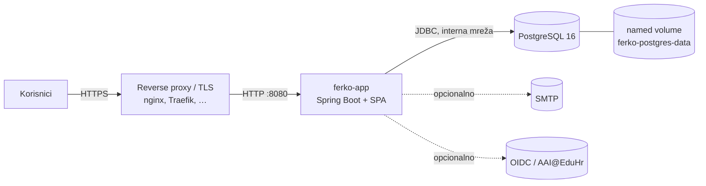

# Produkcijski deployment

FERKO se u produkciji pokreće hardened Compose datotekom `docker-compose.prod.yml` uz `prod` Spring
profil. Za lokalni demo i dalje vrijedi `./scripts/dev-up.sh` (`docker` profil, seedani podaci).

## Topologija



- **ferko-app** — jedini servis izložen na hostu (`:8080`); iza njega stavite reverse proxy s TLS-om.
- **postgres** — nije objavljen na host; dostupan samo aplikaciji preko interne mreže; podaci u
  imenovanom volumenu.

## Razlike u odnosu na dev (`docker-compose.yml`)

| | dev (`docker` profil) | prod (`prod` profil) |
|---|---|---|
| Seedani demo podaci | da | **ne** |
| Dev token endpoint | uključen | isključen |
| Rate-limiting prijava | isključen | **uključen** |
| JWT dekoder | HMAC (dev secret) | **OIDC-first** (HMAC samo opt-in) |
| PostgreSQL na hostu | objavljen :5432 | **nije objavljen** |
| Tajne/konfiguracija | dev defaulti | **iz okoline (.env), bez defaulta** |
| App healthcheck | (host skripta) | u kontejneru (`/actuator/health`) |

## Postupak

1. Kopirajte predložak i popunite tajne:
   ```bash
   cp .env.example .env
   # uredite .env — DB lozinka, autentikacija (OIDC ili HMAC), e-mail …
   ```
2. Odaberite autentikaciju:
   - **OIDC (preporučeno):** postavite `FERKO_OIDC_ISSUER_URI` (npr. AAI@EduHr).
   - **Self-hosting bez IdP-a:** `FERKO_JWT_ALLOW_HMAC_DECODER=true` + jak `FERKO_JWT_HMAC_SECRET`.
3. Pokrenite:
   ```bash
   docker compose -f docker-compose.prod.yml --env-file .env up -d --build
   ```
4. Provjerite zdravlje i verziju:
   ```bash
   curl -fsS http://localhost:8080/actuator/health   # {"status":"UP"}
   curl -fsS http://localhost:8080/actuator/info      # build verzija
   ```

## Napomene

- Migracije baze (Flyway) izvode se automatski pri pokretanju.
- Prod profil **ne seeda** korisnike; početni administrator se provizionira izvan seeda (ISVU
  sinkronizacija / ručno). Demo korisnici postoje samo u `docker`/dev profilu.
- E-mail je po defaultu „logging sender” (bez SMTP-a); za stvarno slanje postavite `FERKO_MAIL_ENABLED=true`
  i `FERKO_MAIL_HOST`. SMTP nedostupnost ne utječe na zdravlje aplikacije (mail health indikator je isključen).
- TLS terminira reverse proxy; aplikacija očekuje `X-Forwarded-*` zaglavlja (`server.forward-headers-strategy=framework`).
