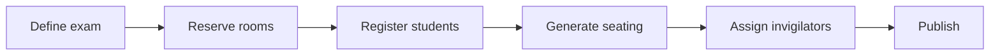
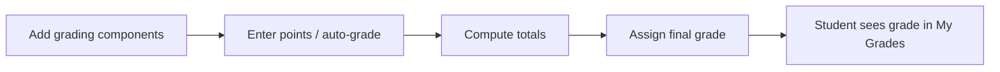

# FERKO User Guide

FERKO is a modernized academic portal for a large engineering faculty. It covers the full
academic workflow: course administration, knowledge assessments (exams), gradebooks, room and
timetable management, surveys, forums, file repositories, group exchange, and an evolutionary
scheduling engine for both class and exam timetables.

The user interface is bilingual (Croatian and English); switch languages from the language toggle
in the page footer. Route paths are in Croatian and are listed below exactly as they appear in the
address bar.

## Trying the demo

Run the application and open `http://localhost:8080`. Started with `docker compose up` (the `docker`
profile), the instance ships with an active **Summer 2026** semester pre-seeded with the full real
FER dataset — roughly 170 courses with real enrollments and around 3,500 students, course holders
and lecturers, demonstrators, room inventory derived from the timetable, the weekly timetable, and
simulated points and final grades — plus a past Winter 2025/2026 semester. (The non-Docker default
profile caps the seed at a small subset for fast tests; the scale is configurable via
`FERKO_SEED_ACADEMIC_MAX_COURSES` and `FERKO_SEED_ACADEMIC_MAX_STUDENTS`, where 0 means no limit.)

Demo accounts (all share the password `ferko123`):

| Username | Role |
| --- | --- |
| `admin.ferko` | Admin |
| `lecturer.marko` | Course holder (NOSITELJ) |
| `assistant.iva` | Assistant (ASISTENT) |
| `student.ana` | Student |
| `stuslu.sara` | Student services (STUSLU) |

Sign in at `/login`. After authentication every user lands on the dashboard (`/`).

## Navigation overview

The top navigation bar adapts to your role. Links that are always visible: Home (`/`), Courses
(`/kolegiji`), Timetable (`/raspored`), Calendar (`/kalendar`), Notices (`/obavijesti`), Rooms
(`/prostorije`), e-Portfolio (`/e-portfolio`), and Profile (`/profil`). Role-specific links:

- **My Exams** (`/moje-provjere`) and **My Grades** (`/moji-bodovi`) — students only.
- **My Invigilations** (`/moja-dezurstva`) — teaching staff, holders, assistants, organizing assistants.
- **Students** (`/studenti`) — Admin and Student services.
- **Admin** (`/admin`) — Admin only.

## The dashboard (`/`)

Everyone sees: the active semester, summary tiles (courses in semester, weekly slots, upcoming
exams, room count), the next upcoming exams, the latest notices, and quick links to courses.

Role-specific cards:

- **Students** see a "My studies" shortcut card (My Exams, My Grades, Profile) and, if they hold any,
  a **My Demonstratures** card listing courses where they serve as a demonstrator.
- **Invigilators** (teaching staff, holders, assistants, organizing assistants) see a **My
  Invigilations** card summarizing assigned exam duties.

---

## Roles at a glance

FERKO roles: `STUDENT`, `NASTAVNIK` (teaching staff), `NOSITELJ` (course holder), `ASISTENT`
(assistant), `ASISTENT_ORGANIZATOR` (organizing assistant), `STUSLU` (student services), and `ADMIN`.

The course detail page derives permissions from your role: holders manage staff assignments,
content authors (holder, teaching staff, organizing assistant) edit notices/literature/components,
holders/organizing assistants/admin administer exams and demonstrators, and the gradebook is open to
all teaching roles plus assistants.

---

## Student

What you can do:

- **Browse courses** at `/kolegiji` and open any course at `/kolegiji/:id` to read the description,
  literature, weekly schedule, consultations, demonstrators, staff, groups, and course notices.
- **Register for exams** at `/moje-provjere`. Each exam shows its type, duration, max points, and
  term. Use **Register** / **Unregister** while registration is open. Once the seating plan is
  published, your assigned room, seat number, and test group appear and registration is locked.
- **View grades** at `/moji-bodovi`: points per component, totals, maximums, and the final grade per
  course (or "not yet finalized").
- **Submit course surveys** at `/kolegiji/:id/ankete` by rating each question 1–5.
- **Ask questions on the forum** at `/kolegiji/:id/forum` — post a new question or reply to a thread.
- **Download course files** from the repository at `/kolegiji/:id/repozitorij`.
- **Request a group change** at `/kolegiji/:id/burza`: choose source and target group and a reason;
  the request is queued as pending until staff decides.
- **Maintain an e-Portfolio** at `/e-portfolio`: add projects, achievements, skills, and certificates
  (with optional link), and remove your own entries.
- **View timetable, calendar, notices, rooms, and profile** (shared pages, below).
- **See your demonstratures** on the dashboard if you are assigned as a demonstrator on any course.

Students cannot administer exams, edit gradebooks, decide group exchanges, or access the Students /
Admin pages.

---

## Teaching staff (NASTAVNIK)

What you can do:

- Everything a course detail page offers as a content author on `/kolegiji/:id`: **publish course
  notices**, **add literature**, **add course components** (free-text sections such as grading
  rules), and **manage consultation slots** (add/remove).
- **Manage the gradebook** at `/kolegiji/:id/bodovi`: see the full points overview, add grading
  components, enter points per student/component, assign final grades (1–5), and run the
  multiple-choice **auto-grading** tool (answer key plus per-student submissions).
- **Create and run course surveys** at `/kolegiji/:id/ankete` and view aggregated results
  (average and response count per question).
- **Upload files** to the course repository at `/kolegiji/:id/repozitorij`.
- **Publish global notices** at `/obavijesti`.
- **View invigilation duties** at `/moja-dezurstva` and on the dashboard.
- **View students** at `/studenti` (read-only roster, available to all teaching roles).

Teaching staff do not, by default, administer exams (seating/room reservation) or assign demonstrators
— those are holder/organizing-assistant actions.

---

## Course holder (NOSITELJ)

The holder has the widest authority over a course. In addition to all teaching-staff capabilities:

- **Manage course staff** on `/kolegiji/:id`: assign a user (by username) the role of holder,
  teaching staff, organizing assistant, or assistant.
- **Assign and remove demonstrators** on the course page (by student JMBAG).
- **Administer exams** at `/kolegiji/:id/ispiti` (full lifecycle — see below).
- **View the enrolled-student roster and assign students to groups** on the course page.
- **Decide group-exchange requests** at `/kolegiji/:id/burza` (approve / reject).
- **Manage the gradebook**, **surveys**, **repository**, and **publish notices** as above.

---

## Assistant (ASISTENT)

What you can do:

- **Work in the gradebook** at `/kolegiji/:id/bodovi`: enter points, assign grades, add components,
  and run auto-grading.
- **Upload files** to the course repository.
- **View invigilation duties** at `/moja-dezurstva` and on the dashboard (assistants are the people
  most commonly assigned as exam invigilators).
- **View the student roster** at `/studenti`.

Assistants do not administer exams, manage course staff, edit course content/notices, or decide
group exchanges.

---

## Organizing assistant (ASISTENT_ORGANIZATOR)

The organizing assistant combines content-authoring and exam-administration duties:

- **Administer exams** at `/kolegiji/:id/ispiti` (full lifecycle) — including reserving rooms,
  registering students, generating seating, assigning invigilators, and publishing.
- **Assign and remove demonstrators** on the course page.
- **Edit course content**: notices, literature, components, consultations.
- **Manage the gradebook**, **create surveys**, **upload files**.
- **Decide group-exchange requests**.
- **Publish global notices** at `/obavijesti`; **view duties** and **the student roster**.

---

## Student services (STUSLU)

Student services handles enrollment-side administration:

- **View students** at `/studenti` (JMBAG, name, study program, year).
- **Assign students to groups** on `/kolegiji/:id` (the roster is visible to holders, admin, and
  student services).
- **Decide group-exchange requests** at `/kolegiji/:id/burza`.
- **Publish global notices** at `/obavijesti`.

Student services does not administer exams or edit the gradebook.

---

## Admin

The admin can do everything the other roles can and has an exclusive console plus the scheduling
generators.

What you can do beyond the operational roles:

- **Admin console** at `/admin`:
  - **Sync status** — counts of semesters, courses, students, and rooms in the system.
  - **Read-only settings** — grading thresholds (excellent / very good / good / sufficient),
    scheduler defaults (population size, iterations, seed), seeding limits, and security flags
    (mail enabled, login rate limiting, OIDC issuer configured).
  - **Create a semester** — code, academic year, term (winter/summer), start/end dates, and whether
    it becomes the active semester.
  - **Semester list**, **user list** (name, username, e-mail, roles, active status), and the
    **audit trail** (timestamp, actor, action, entity, details for administrative actions).
- **Timetable generation and analysis** at `/raspored` (see the timetable section) — these tools are
  admin-only.

---

## Shared pages

### Courses (`/kolegiji`, `/kolegiji/:id`)

`/kolegiji` lists all courses in the active semester (code, name, ECTS, enrolled count) with links to
detail and exams. `/kolegiji/:id` is the course hub: description and literature, action buttons
(exam administration and gradebook appear only to authorized roles; surveys, forum, repository, and
group exchange to everyone), the demonstrator list, course notices, literature, weekly teaching
schedule, consultation slots, custom content components, the teaching-staff table, and the group
table. Authorized roles see inline forms to manage each section.

### Exam administration (`/kolegiji/:id/ispiti`)

Available to holders, organizing assistants, and admin. Other roles see an access-denied notice.
This is the exam lifecycle:

- **Define** a new exam: name, short name, and type (midterm, final, short quiz, make-up).
- **Reserve rooms**: pick a room and capacity for the exam.
- **Register students** in bulk from the course enrollment.
- **Generate seating** using a strategy: the genetic optimizer, or sorted/random greedy and
  proportional heuristics. The result shows per-room seat assignments and a feasibility flag.
- **Compare algorithms**: run all six metaheuristics on the same seating problem (equal budget and
  seed), inspect penalty, iterations, runtime, and convergence sparklines, then **Apply** the chosen
  one.
- **Assign invigilators** (duty assistants) to reserved rooms by username; remove as needed.
- **Publish** the seating plan, after which students see their room and seat.

A progress diagram tracks the five steps for the selected exam.

### Gradebook (`/kolegiji/:id/bodovi`)

Available to all teaching roles plus assistants and admin. View the color-coded points matrix
(students × components, totals, final grades), add components, enter points, assign final grades, and
run multiple-choice auto-grading from an answer key and submission list.

### Surveys (`/kolegiji/:id/ankete`)

Everyone can complete surveys (rate questions 1–5). Holders, teaching staff, organizing assistants,
and admin can create surveys and view aggregated results.

### Forum (`/kolegiji/:id/forum`)

Course Q&A. Anyone enrolled or assigned to the course can post a top-level question and reply to
threads.

### Repository (`/kolegiji/:id/repozitorij`)

Course files. Everyone can download; teaching roles, organizing assistants, assistants, and admin can
upload.

### Group exchange (`/kolegiji/:id/burza`)

Students submit group-change requests (from group, to group, reason). Holders, organizing assistants,
student services, and admin approve or reject pending requests.

### Timetable (`/raspored`)

Everyone sees the weekly grid (grouped by day, filterable by course/code/room) showing time, course,
room, and instructor. **Admin-only** tools above the grid:

- **Quality / collisions** — total slots, room conflicts, instructor conflicts, the conflict list,
  and **room utilization**.
- **Generate a class timetable** — choose study year, number of periods, and one of six algorithms
  (genetic, differential evolution, Max-Min ant system, particle swarm, immune algorithm, CLONALG);
  see baseline-vs-result conflicts, iterations, feasibility, a convergence sparkline, and assignments.
- **Generate an exam timetable** — choose study year, slot count, and algorithm; compare against a
  legacy baseline.
- **Compare algorithms** — run all algorithms on the same problem and compare conflicts, iterations,
  runtime, and convergence.

### Calendar (`/kalendar`)

A weekly class grid (lectures vs. labs, with rooms) plus a list of upcoming dated exams.

### Notices (`/obavijesti`)

The notice feed. Holders, teaching staff, organizing assistants, student services, and admin can
publish notices (with an optional pinned flag).

### Rooms (`/prostorije`)

Read-only room inventory: code, building, capacity, required invigilators, and whether the room has
computers.

### Students (`/studenti`)

Read-only roster (JMBAG, name, study program, year). Visible to admin, student services, and teaching
roles; the navigation link appears only for admin and student services.

### Profile (`/profil`)

Your account details: name, username, e-mail, roles, and — for students — JMBAG, study program, and
year.

### e-Portfolio (`/e-portfolio`)

Your personal record of projects, achievements, skills, and certificates, each with an optional link.
Add and remove your own entries.

---

## Tips

- Unknown or unauthorized routes redirect to the dashboard; some pages additionally show an
  access-denied banner when your role lacks permission.
- Switch the interface language (HR/EN) any time from the footer toggle.
- The application version is shown in the footer.
